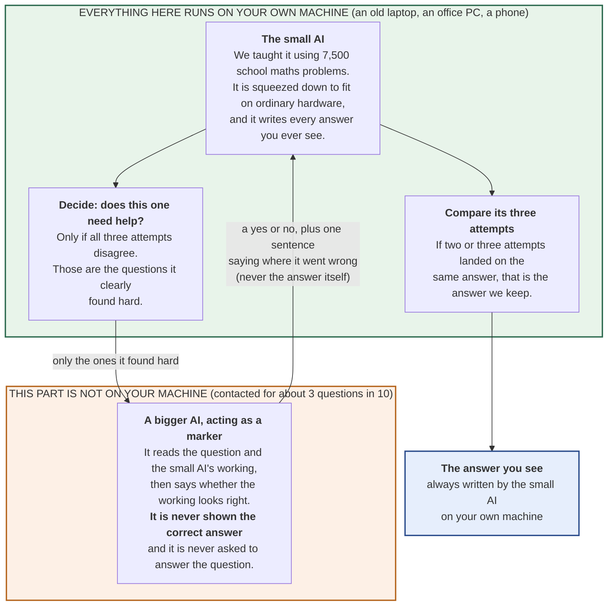
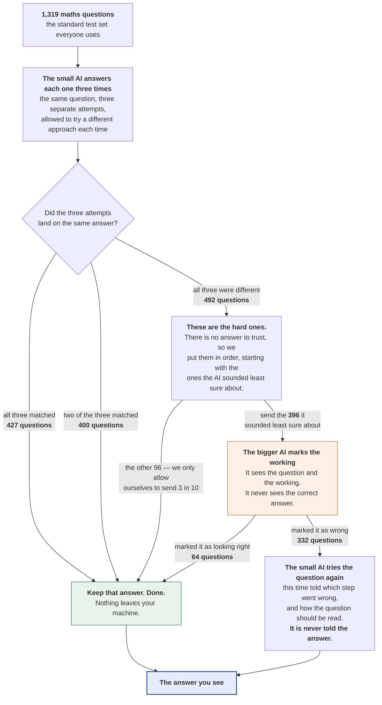
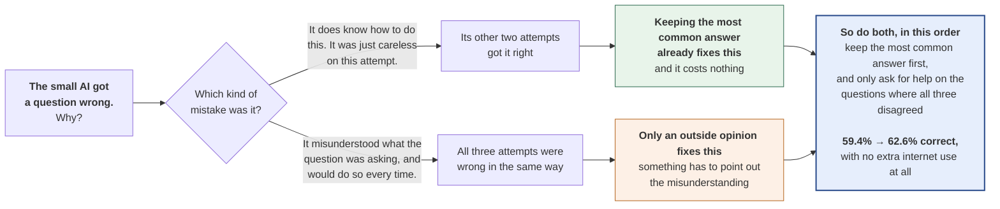
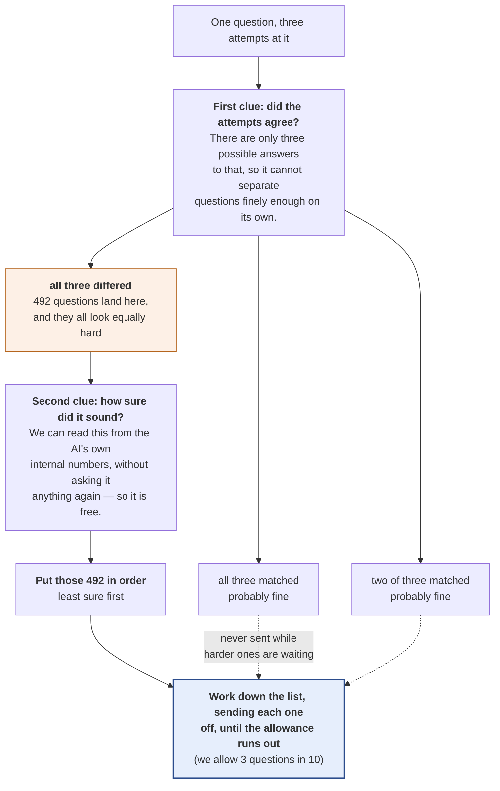
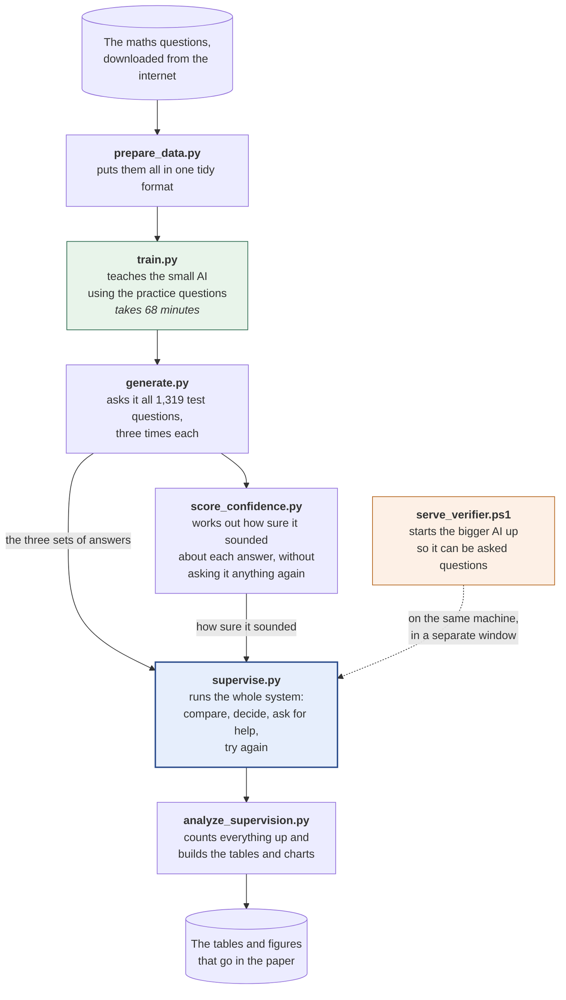
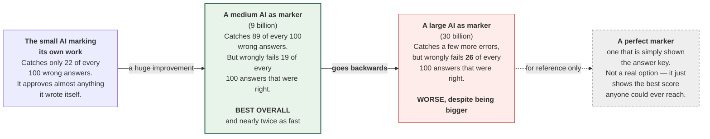

# Diagrams for the paper — plain language

> **Two versions of every diagram exist. This is the plain-language one.**
>
> | Version | File | Pictures | Use it for |
> |---|---|---|---|
> | **Plain language** (this file) | `docs/DIAGRAMS.md` | `reports/figures/` | Teammates who are not engineers; explaining the system to anyone; a defence audience that includes non-specialists |
> | **Technical** | [`docs/diagrams-technical/DIAGRAMS_TECHNICAL.md`](diagrams-technical/DIAGRAMS_TECHNICAL.md) | `reports/figures/technical/` | The submitted paper, if your supervisor prefers standard terminology in figures |
>
> They show the **same system with the same measured numbers** — only the wording
> differs. The file names match across both folders, so you can swap one set for the
> other without touching your document's figure references.
>
> **If you change a number, change it in both files.** That is the one risk of
> keeping two versions, and nothing checks it for you.

**Who this is for:** whoever is assembling the report. You do not need to understand
the code. Every diagram below is written in ordinary words, with a caption you can
paste and a note on which section it belongs in.

**How to use these.** Each diagram is written in Mermaid, a plain-text way of
describing a picture. GitHub draws them automatically, so just scrolling this page in
your browser shows the finished images. Ready-to-insert files are in `reports/figures/`
as both `.svg` (stays sharp at any size — use this in Word if you can) and `.png`
(works everywhere).

**To change one:** edit the text in the grey box, then run
`.\scripts\render_diagrams.ps1` to redraw the pictures. You do not need design
software, and you should **not** redraw these by hand in Canva or PowerPoint — the
text here is the master copy, and a hand-drawn copy goes out of date silently the
moment a number changes.

**Every number in these diagrams is a real measurement.** If a number changes in
`THESIS_DOSSIER.md`, change it here too, in the same commit.

---

## Plain words, and the technical word for each

The diagrams use everyday language on purpose. When you write the *body* of the paper,
use the proper term from the right-hand column — examiners expect it. Introduce each
one once, in brackets, the first time you use it.

| What the diagrams say | The technical term | What it actually means |
|---|---|---|
| the small AI on your device | **the fine-tuned model** / the solver | The 2-billion-parameter model we trained. Small enough to run on ordinary hardware |
| the bigger AI that marks the work | **the supervisor** / the verifier / the checker | A larger model whose only job is to say whether the working looks right |
| asking for a second opinion | **escalation** | Sending a question to the bigger AI instead of answering it alone |
| about 3 questions in 10 | **a 30% escalation rate** | How often we are willing to ask for help |
| deciding which ones to send | **the gate** | The rule that picks which questions get a second opinion |
| the hard ones | **questions with high disagreement** | Ones where the three attempts all gave different answers |
| how sure the AI sounded | **confidence** (log-probability) | Read from the AI's own internal numbers. Costs nothing extra to obtain |
| taking the most common answer | **self-consistency** / majority voting | Ask three times, keep whichever answer appeared most |
| trained on 7,500 problems | **QLoRA fine-tuning** | A cheap way of teaching a model a new skill without retraining all of it |
| compressed to fit in memory | **4-bit quantisation** | Storing the AI's numbers roughly instead of exactly, so it fits on a small machine |
| doing both, in order | **stacking** | Take the most common answer first; only ask for help when the three disagree |

---

## Figure 1 — What the system is made of
<!-- figure: fig1_system_architecture -->

**Goes in:** Method, as the first figure. **Caption you can paste:**

> Figure 1: System architecture. The fine-tuned 2B model, the majority vote and the
> escalation gate all run on the local device. The supervisor is contacted only for
> questions the gate selects, and never receives the correct answer.



**The point of this figure:** everything is inside the green box except one thing. The
orange box is the only part that needs an internet connection, and it is a *marker*,
not an answerer — it never writes an answer, it only says whether one looks right.
That is the difference between "the internet answers your question" and "the internet
checks your machine's homework."

---

## Figure 2 — What happens to one question
<!-- figure: fig2_per_question_data_flow -->

**Goes in:** Method, immediately after Figure 1. **This is the most important diagram
in the paper.** Caption you can paste:

> Figure 2: Per-question data flow across the full GSM8K test set (n = 1,319). All
> counts are measured. 923 questions (70%) are resolved entirely on the device; 396
> (30%) are escalated to the supervisor, of which 332 are rejected and retried.



**Two things to say about this figure in the text:**

1. **923 of the 1,319 questions never leave the machine** — that is 427 + 400 where the
   attempts agreed, plus 96 hard ones we chose not to send because we had used up our
   allowance.
2. **The three attempts had to be made anyway**, in order to spot the hard ones. So
   comparing them and keeping the most common answer costs nothing extra. This is why
   the design in Figure 3 is free.

---

## Figure 3 — Why you need both halves
<!-- figure: fig3_why_stacking_works -->

**Goes in:** Discussion, as the figure for the main finding. **Caption:**

> Figure 3: The two mechanisms repair different questions. Majority voting corrects
> unlucky sampling; the supervisor corrects consistent misreadings. Because the two
> sets barely overlap, using the supervisor *instead of* the vote discards free
> accuracy — which is why every un-stacked configuration failed to beat
> self-consistency.



**Say in the text:** used *instead of* comparing the three attempts, the marker gave no
reliable improvement at all. Used *on top of* it, every version improved. The two
halves repair different mistakes, so you need both.

---

## Figure 4 — How we choose which questions to send
<!-- figure: fig4_the_escalation_gate -->

**Goes in:** Method, where the selection rule is described. **Caption:**

> Figure 4: The combined gate. Questions are ordered by how much the three samples
> disagree; ties within a disagreement level are broken by the model's own confidence.
> Confidence reorders questions inside a tied group but can never outrank
> disagreement, so there is no weight to tune.



**Why it is built this way.** The first clue can only ever say one of three things, so
it cannot tell you *which* of the 492 equally-hard questions to send. The second clue
breaks those ties. We tried letting the second clue overrule the first, and it worked
*worse* — so it is deliberately allowed only to decide the order within a tied group.

Both clues were already being worked out for other reasons, so combining them cost
nothing. Doing so raised the quality of the choice from **0.840 to 0.869** (1.0 would be
a perfect chooser, 0.5 would be random guessing), and caught **125 wrong answers
instead of 105** when only allowed to send 1 question in 10.

---

## Figure 5 — How the experiments were run
<!-- figure: fig5_experiment_pipeline -->

**Goes in:** an appendix, or the paragraph about repeatability. **Caption:**

> Figure 5: Experimental pipeline. Each box is a script in the repository; each arrow
> names the file it writes. The first attempt at every question is generated once and
> reused by every later experiment, so all comparisons are exactly paired.



**Worth one sentence in the text:** the small AI's first attempt at each question was
generated once and then reused by every experiment. That means every version of the
system was tested on *exactly* the same starting answers, so any difference between
them is caused by the thing we changed, not by the AI happening to have a better day.

---

## Figure 6 — How good does the marker need to be?
<!-- figure: fig6_checker_strength_ladder -->

**Goes in:** Results. **Caption:**

> Figure 6: Supervisor strength as a measured variable. Moving from 2B self-checking to
> a 9B supervisor sharply increases errors caught; moving from 9B to 30B makes false
> rejections worse. Supervisor capability is not monotonically beneficial.



**The sentence this figure exists to support:** *there is a size of marker that fits the
job, and the 30-billion one overshoots it.* A marker that fails right answers too
readily destroys good work faster than it repairs bad work — so "use the biggest model
you can" turns out to be wrong advice here.

---

## What should NOT be a diagram

Results that are just *numbers* belong in a table or a chart, not in boxes and arrows:

- **Accuracy against internet cost** — already drawn, in `reports/figures/pareto.png`.
  Use it as the main results figure.
- **How many answers were turned from wrong to right, and right to wrong** — a small
  four-box table reads far better than any diagram.
- **The full list of results** — a table. Do not try to draw it.

---

## Redrawing the pictures

The `.svg` and `.png` files are generated from the Markdown. After editing any diagram
above, run:

```powershell
.\scripts\render_diagrams.ps1              # redraws BOTH wordings
.\scripts\render_diagrams.ps1 -Plain       # only this file's pictures
.\scripts\render_diagrams.ps1 -Technical   # only the technical ones
.\scripts\render_diagrams.ps1 -Only fig2   # one figure, both wordings
```

Running it with no options redraws both sets, which is the safe default — it keeps
the two versions from silently falling out of step.

Both wordings produce **the same six file names**, in different folders:
`reports/figures/` for these, `reports/figures/technical/` for the formal ones.

| File | What it shows |
|---|---|
| `fig1_system_architecture` | What the system is made of |
| `fig2_per_question_data_flow` | What happens to one question |
| `fig3_why_stacking_works` | Why you need both halves |
| `fig4_the_escalation_gate` | How we choose which questions to send |
| `fig5_experiment_pipeline` | How the experiments were run |
| `fig6_checker_strength_ladder` | How good the marker needs to be |

Adding a new `## Figure N — Title` section with a grey Mermaid box is enough; the
script will find it on its own, with no other changes needed.
