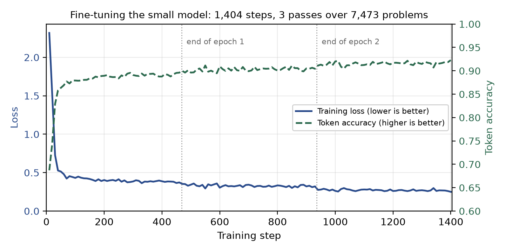
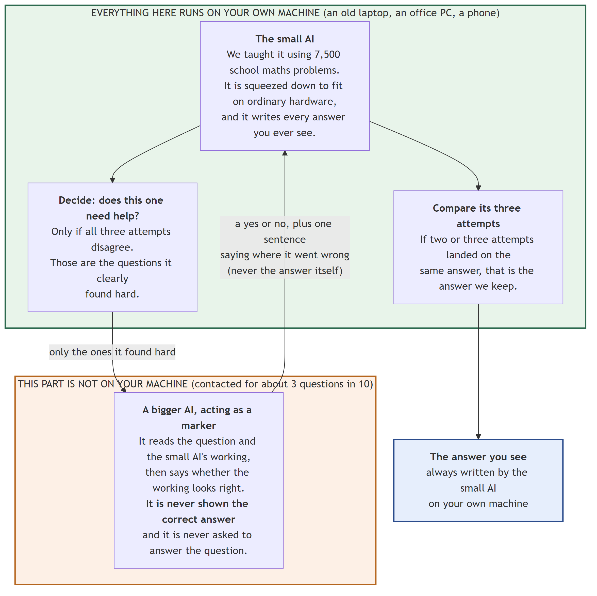
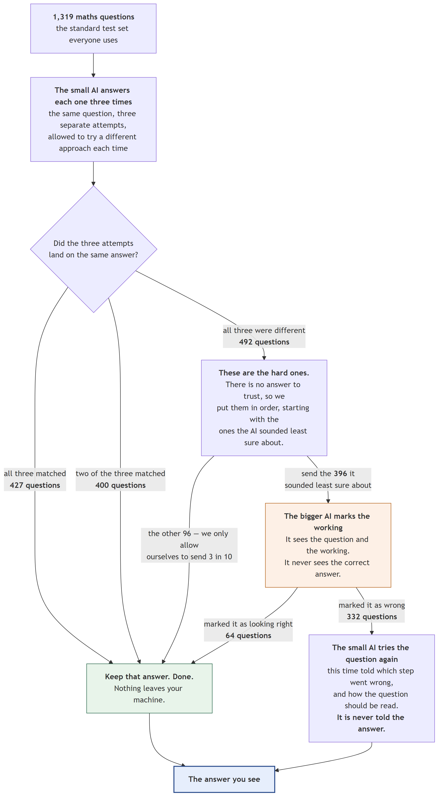
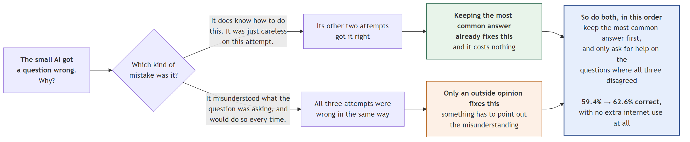
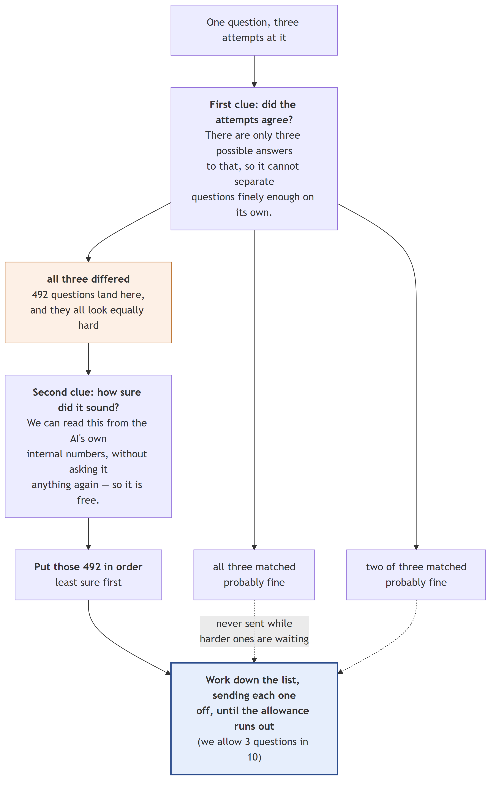
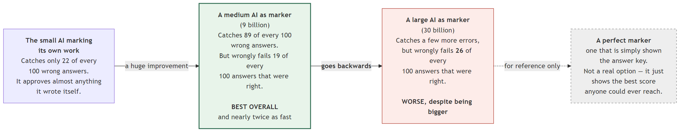
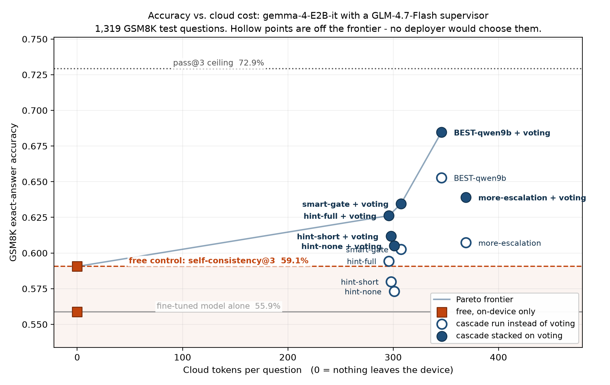

# Answer Locally, Verify Rarely

### A small AI that solves maths problems on your own device, and asks a bigger AI for help only when it needs to

**Final Year Design Project — Report**

---

## Abstract

Good maths-solving AI is enormous. It runs in a data centre, it costs money every time you
use it, and every question you ask it leaves your device. We wanted to know if a small AI
could do the work on the device itself, and call for outside help only rarely.

We took `google/gemma-4-E2B-it`, a small model, squeezed it down to 4 bits so it fits in an
ordinary graphics card, and trained it on 7,473 school maths problems. That took it from
**36.32% to 55.88%** correct on the 1,319 test problems, while reading about 8 times fewer
words per question.

Then we built a **cascade** (a system where an easy step handles most of the work and a harder
step is used only for the leftovers). The small AI answers every question. A **gate** (a piece
of code that decides which questions look risky) picks out about 3 questions in 10. Only those
go to a bigger AI, which marks the answer without ever being shown the correct one, and sends
back a short hint. The small AI then tries again.

The best version reaches **68.46%** — 903 of 1,319 problems. That is **93.9%** of everything
this small model could possibly have got right, and 7 out of 10 questions never leave the
device.

Two results surprised us, and both are in this report:

1. **The obvious version of our idea did not work.** Used on its own, the cascade scored
   59.44% against 59.06% for simply asking the model three times and taking the most common
   answer — which is free. The difference was not statistically meaningful. The fix was to do
   both, in order: vote first, then send only the split votes to the checker. That added 42
   correct answers at exactly the same cost.
2. **The bigger checker was the worse checker.** A 9-billion-parameter model beat a
   30-billion one on every measure and ran about twice as fast.

We do not claim a record. Other published systems score higher on this dataset. What we
report is a **trade-off curve**: how much accuracy you get as a function of how rarely the
device asks for help.

---

## Contents

| Chapter | |
|---|---|
| 1 | Introduction |
| 2 | Background — the words you need |
| 3 | What other people have already done |
| 4 | The dataset and how we prepared it |
| 5 | Making the model fit: shrinking and training |
| 6 | Building it on a machine that keeps losing power |
| 7 | How the finished system works |
| 8 | Every system we tried |
| 9 | Results |
| 10 | What did not work |
| 11 | Limitations |
| 12 | Conclusion and future work |
| A–D | Appendices |

---

# Chapter 1 — Introduction

## 1.1 The problem

The AI models that are good at maths are very large. They have hundreds of billions of
internal numbers, they need racks of specialised hardware, and they live in data centres
owned by a handful of companies. If you want to use one, you send your question over the
internet and pay for the reply.

That is fine for some things. It is a bad fit for others:

- **It costs money every single time.** Not once — every question, forever.
- **Your question leaves your device.** For a student's homework that may not matter. For a
  medical form, a legal document, or a company's internal numbers, it matters a lot.
- **It needs a working internet connection.** Not everywhere has one that is reliable.

The obvious alternative is to run a small model on the device instead. The problem is that
small models are much worse at maths. That is the gap this project tries to close.

## 1.2 The question we asked

> **Can a small model running on your own device do most of the work, and ask a bigger model
> for help only rarely — rarely enough that the cost and the privacy problem mostly go away?**

The word "rarely" is doing the real work in that sentence. If the small model asks for help on
every question, we have not built anything: we have just added a slow step in front of the big
model. The whole design only means something if help is the exception.

## 1.3 What we built

Four pieces, all running on one ordinary desktop computer:

1. **A small AI that answers.** `google/gemma-4-E2B-it`, squeezed to 4 bits and trained by us
   on school maths problems.
2. **A way of guessing when it is wrong.** We ask it the same question three times. If it
   gives three different answers, it is unsure, and that question is probably wrong.
3. **A bigger AI that marks the answer.** It is shown the question and the small AI's working.
   It is **never** shown the correct answer. It replies with "right" or "wrong", plus a short
   hint.
4. **A retry.** The small AI sees the hint and tries again.

Importantly, every model in this project — including the bigger checker — ran on our own
machine. No cloud service was used for any reported number.

## 1.4 The headline result

| Stage | Correct out of 1,319 | Score |
|---|---|---|
| The model before we trained it | 479 | **36.32%** |
| The same model after we trained it | 737 | **55.88%** |
| The full system | 903 | **68.46%** |

Before anyone reads 68.46% as "nearly there", here is the number that puts it in proportion:

**72.93%** is the ceiling. That is the score you would get if, out of the three answers the
small model gives, a magic oracle always picked the right one. The model simply does not know
the answer to the remaining 27% of questions, in any of its attempts. So the real space
available to us was 55.88% → 72.93%. Our best score, 68.46%, is **93.9% of that ceiling**, and
it closes **73.8%** of the gap between the trained model and the ceiling.

We think stating the ceiling next to the result is the honest way to report this, and we do it
throughout.

## 1.5 What we are claiming

Three things, no more:

**Claim 1 — the cascade has to be stacked, not substituted.** Used *instead of* free majority
voting, our supervised cascade could not be shown to beat it. Used *on top of* voting — vote
first, escalate only the split votes — every version beat it, at exactly the same cost. We
believe this is the most useful thing in the report, because it is the mistake a reader would
otherwise repeat.

**Claim 2 — checker strength is not the same as checker size.** We tested four checkers of
increasing size. The results do not go up in a straight line. The 9-billion model beat the
30-billion one on every measure we took.

**Claim 3 — the gate can be free.** The signal that best predicts a wrong answer is not the
model's own confidence. It is whether the model contradicts itself across repeated attempts —
and if you are already voting, you have paid for that signal anyway.

## 1.6 What we are *not* claiming

We are not claiming a record score on this dataset. We are not.

Published work reports higher numbers on the same problems: one system reports 81.5% using two
models smaller than ours, and an off-the-shelf model of comparable size is reported at 73.2%
with no training and no cascade at all. Chapter 3 explains both in detail, including why the
comparison is less direct than it first looks.

We are also not claiming the small AI *reasons* correctly. We only ever checked its final
number. A right answer reached by muddled working still counts as right in our score.
Chapter 11 says more.
---

# Chapter 2 — Background: the words you need

This chapter explains every technical word used later. If you already know them, skip to
Chapter 3.

## 2.1 What a language model is

A language model is a program that predicts the next word. You give it some text, it guesses
what comes next, then it adds that guess to the text and guesses again. Do that a few hundred
times and you get a paragraph.

Everything a model "knows" sits in a huge list of numbers called **parameters** (the internal
settings a model learns during training). A small model has a few billion. The big ones have
hundreds of billions. More parameters usually means better answers and a bigger, slower,
more expensive model.

## 2.2 Tokens

Models do not read words. They read **tokens** (pieces of text, usually about three quarters
of a word). "Unhappiness" might be three tokens: `un`, `happi`, `ness`.

Tokens matter to us because **tokens are the bill**. Cloud AI services charge by the token,
both for what you send and for what comes back. When we say a question costs 346 tokens, we
mean that is what you would pay for.

## 2.3 GSM8K — our test

GSM8K is a public set of 8,792 school-level maths word problems, written by people. Each one
takes two to eight steps of simple arithmetic. It is split into **7,473 for training** and
**1,319 for testing**. We used the official split exactly as published, and every single
number in this report is measured on all 1,319 test problems — never a sample.

Here is a real one:

> Natalia sold clips to 48 of her friends in April, and then she sold half as many clips in
> May. How many clips did Natalia sell altogether in April and May?

And the answer that ships with it:

```
Natalia sold 48/2 = <<48/2=24>>24 clips in May.
Natalia sold 48+24 = <<48+24=72>>72 clips altogether in April and May.
#### 72
```

Two things to notice. The `<<48/2=24>>` bits are calculator notes built into the dataset. And
the last line starts with `####`. That marker is how GSM8K states the final answer, and it is
what makes automatic grading possible — you look for `####` and compare the number after it.

We chose GSM8K because it can be graded automatically with no human judgement and no room for
argument. An answer is right or it is not.

## 2.4 Fine-tuning

A model that has been trained on the general internet can write English but is not especially
good at any one job. **Fine-tuning** means taking that model and training it further on
examples of the specific job you want. We fine-tuned on 7,473 maths problems so the model
would learn the habit of working step by step and finishing with `#### <number>`.

## 2.5 Quantization — making the model smaller

Each parameter is normally stored as a 16-bit number. **Quantization** (storing each number
with fewer bits so the model takes less memory) cuts that down. We used **4-bit**, which is
roughly a quarter of the size.

The trade is accuracy: rounding every number to 4 bits loses some detail, and the model gets
slightly worse. We accepted that, because the entire premise of the project is a model that
fits on modest hardware. A model that needs a data centre is not solving our problem.

The exact flavour we used is called **NF4**, which spaces the 4-bit values unevenly to match
how these numbers are actually distributed, and loses less than plain rounding would.

## 2.6 LoRA and QLoRA — training without a supercomputer

Normally, fine-tuning means updating all of the model's parameters. For a model this size,
that needs far more memory than a desktop graphics card has.

**LoRA** (Low-Rank Adaptation) avoids it. Instead of changing the original parameters, you
freeze them and add a small set of new ones beside them. Only the new ones are trained. At the
end you have a small **adapter** file that sits on top of the original model and changes its
behaviour.

**QLoRA** is LoRA done on a model that has already been squeezed to 4 bits. It is what made
this project possible on one desktop computer. In our case, the adapter holds **24,158,208**
trainable parameters — about **0.5%** of the model — and the file is 97 MB.

## 2.7 Greedy and temperature — how the model picks words

At each step the model has a ranked list of possible next tokens.

- **Greedy** means always take the top one. Same question in, same answer out, every time.
- **Temperature** means roll a weighted dice instead. Temperature 0 is greedy. Higher numbers
  make it more adventurous. We used **0.7** whenever we wanted variety.

This matters because our gate works by asking the same question three times at temperature
0.7 and seeing whether the answers agree. At temperature 0 you would get the same answer three
times and learn nothing.

## 2.8 The cascade and the gate

A **cascade** is a system where a cheap step does most of the work and an expensive step
handles only what the cheap step cannot.

The **gate** is the part that decides which questions get passed up. **Escalating** a question
means sending it to the bigger checker. **Escalation rate** is what share of questions get
sent — for us, usually 30%.

## 2.9 The checker

Throughout this report we use one word for the bigger model that marks answers: the
**checker**. Other papers call it a verifier, a judge, or a supervisor. They all mean the
same thing and we picked one word to avoid confusion.

The checker is shown the question and the small AI's working. **It is never shown the correct
answer.** This is enforced in the code and there is an automatic test that fails if anyone
ever changes it.

## 2.10 Terms used in the results

| Term | What it means |
|---|---|
| **Self-consistency** | Ask the same question 3 times, keep the most common answer |
| **pass@3** | Would *any* of the 3 attempts have been right? The ceiling |
| **Recall** | Of the wrong answers, what share did the checker catch? |
| **False-reject rate** | Of the right answers, what share did the checker wrongly fail? |
| **Precision** | When the checker said "wrong", how often was it correct? |
| **AUC** | How reliably a warning sign ranks wrong answers above right ones. 0.5 is a coin flip, 1.0 is perfect |
| **p-value** | The chance of seeing a result this lopsided if the two systems were really equal. Small means the difference is real |
| **Flip matrix** | How many answers a change turned from wrong to right, and how many it broke the other way |
| **Stacking** | Doing two things in order — here, voting first and escalating only the split votes |

---

# Chapter 3 — What other people have already done

We grouped the 25 papers we read by what they were trying to do. The last group is the
uncomfortable one, and we put it in deliberately.

## 3.1 Making a small model good at maths

**Cobbe and colleagues (2021)** created GSM8K itself. They also had the original version of
our idea: train a separate model to check answers, generate many candidates, and keep the one
the checker likes best. With it, a 6-billion model beat a 175-billion model. That is the
ancestor of everything in this report. The difference is that their checker picks between
answers; ours sends feedback so the model can try again.

**Wei and colleagues (2022)** showed that asking a model to write out its steps before the
answer — chain-of-thought — improves maths accuracy sharply. Our whole training set is in
that format.

**Hu and colleagues (2022)** invented LoRA. **Dettmers and colleagues (2023)** combined it
with 4-bit quantization to make QLoRA. Between them, they are the reason this project fits on
one desktop.

**Li and colleagues (2025)** found something we should have taken more seriously earlier:
small models learn badly from the very long reasoning that large models produce. Short,
simple worked examples teach them better. Our training data is short and simple, which is
probably lucky rather than clever.

## 3.2 Getting more out of one model at answer time

**Wang and colleagues (2023)** introduced self-consistency: sample several answers, take the
majority. **This is the most important paper for us**, and not in a comfortable way — it is
free, it needs no second model, and it is the baseline that nearly killed our result. On a
540-billion model it added 17.9 points. On ours it added 3.2. Any paper proposing a more
complicated method must beat this one first, and Chapter 10 describes what happened when we
tried.

**Aggarwal and colleagues (2023)** made voting adaptive — stop sampling once the answers agree.
Same instinct as our gate: spend effort only where there is doubt.

**Snell and colleagues (2024)** showed that spending compute at answer time can beat a model
14 times larger. That is the strongest general argument for what we built.

**"Self-Consistency Is Losing Its Edge" (2025)** reports that on newer, stronger models the
benefit of voting is shrinking. Worth knowing, but not true of ours: voting gave us a real,
statistically solid gain.

## 3.3 Cascades and routing

**Chen, Zaharia and Zou (2023) — FrugalGPT** is the best-known cost-saving cascade: try a
cheap model, and escalate to an expensive one when a scorer says the answer is weak. They
report up to 98% cost reduction. There is one structural difference from us, and it matters:
**in FrugalGPT the expensive model answers the question. In ours it only marks the answer.**
The expensive model never writes a solution, so the cost is a short verdict rather than a full
reply.

**Gupta and colleagues (2024)** is the closest published work to our gate. They use
token-level uncertainty to decide when to defer, and they report that answer length is a
biased signal. We measured the same thing: length was our weakest gate (AUC 0.676).

**Zellinger and colleagues (2025)** add the option of giving up early. **Ong and colleagues
(2024) — RouteLLM** learn to route between models. **Kim and colleagues (2023) — Big Little
Decoder** switch models mid-sentence. All share our premise; none of them feed a hint back for
a retry.

## 3.4 Using one model to check another

**Zheng and colleagues (2023)** established that a strong model can judge answers and agree
with human judges more than 80% of the time. They also documented **self-enhancement bias** —
models prefer their own output. That predicts exactly the failure we measured when we asked
our small model to check its own work (Chapter 10).

**Lightman and colleagues (2023)** showed that checking each step beats checking only the
final answer. We check the whole solution at once, which is cheaper and weaker. Their result
is a good description of what we left on the table.

**"Not All Votes Count!" (2024)** is the closest thing to our stacking result: use a checker
to weight votes rather than replace them, reporting up to +18% on GSM8K. We found the same
direction independently. Theirs weights the votes; ours escalates only where the vote is
split.

## 3.5 The negative results that justify our design

**Huang and colleagues (2024) — "LLMs Cannot Self-Correct Reasoning Yet"** found that asking a
model to revise its own answer without outside information makes things *worse*. We ran the
same experiment on a model about 100 times smaller and got the same result: our blind-retry
control dropped from 55.88% to 49.89%. That control is the reason we can say the checker is
doing the work and not the retry.

**Zhang and colleagues (2024) — "Small LMs Need Strong Verifiers"** is the closest work to our
checker-strength question. They compare two checker sizes. We extended it to four rungs and
found the relationship is **not** monotonic — bigger stops helping and starts hurting.

**Madaan and colleagues (2023) — Self-Refine** and **Shinn and colleagues (2023) — Reflexion**
both get improvements from iterative self-criticism, but on much larger models. The tension
with Huang is real and unresolved in the literature; our own result sits on Huang's side.

## 3.6 Running models on ordinary hardware

**Lu and colleagues (2024)** survey small language models. **"Demystifying SLMs for Edge
Deployment" (2025)** benchmarks over 60 of them and finds that compressed models under 7
billion parameters keep roughly 90–95% of their quality. That is the empirical basis for
believing a 4-bit 2-billion model is worth building on at all.

**Bondarenko and colleagues (2026)**, from Qualcomm, is the closest concurrent work: efficient
reasoning on edge hardware. They optimise the model. We keep the model and add a checker.
The approaches are complementary.

## 3.7 Has anyone beaten our 68.5%? Yes.

This section exists because a reader will ask, and it is better that we answer first.

### TinyGSM — 81.5%

**Liu and colleagues (2023)** report **81.5%** on GSM8K using a 1.3-billion generator and a
1.3-billion checker. Both models are smaller than ours. That is 13 points above our best
result, and we should say plainly that it is a better score.

The differences, so a reader can judge for themselves:

| | TinyGSM | Ours |
|---|---|---|
| Training data | 12.3M synthetic problems generated by GPT-3.5 | 7,473 real problems |
| Answer format | Python code, actually executed | Natural language |
| Checker | Trained for the job | Prompted, not trained |
| Generations per question | **48**, all scored by the checker | **3** |
| Metric | verify48@1 | greedy exact match |

**The 48 is the number to remember.** Their headline is "generate 48 answers, let a trained
checker rank them, take the top one". That is 16 times more work on the device — the exact
axis this project is about. 81.5% versus 68.5% is not one system beating another at equal
cost.

And the honest concession that goes with it: **their fine-tuning-only model scored 68.2%,
above our 55.88%.** The reason is the 12.3 million synthetic training problems — about 1,600
times our data — not the architecture. We should say that rather than let someone find it.

### Qwen2.5-1.5B-Instruct — 73.2%

The official Qwen2.5 technical report gives **73.2%** on GSM8K for a 1.5-billion instruction
model with no fine-tuning, no voting and no checker. That is a smaller model, straight out of
the box, above our entire system.

Our answer, in order of how much it is worth:

1. **Every claim we make is a paired comparison on one base model.** We never claim our
   numbers are the best available. We claim that adding a gate and a checker to a given model
   improves it by a measured amount. That comparison is unaffected.
2. **The mechanism is the contribution, not the score.** Claims 1–3 in Chapter 1 are about
   how the pieces behave, and they would still be worth knowing on a stronger base model.
3. **The measurements are not comparable.** Their figure is 4-shot at full precision with
   lenient answer extraction. Ours is zero-shot at 4-bit requiring an exact `#### N` marker.
   Three differences, all favouring them. Neither number is wrong; they are different rulers.
4. Benchmark contamination is a known issue with GSM8K. We mention this last and lightly,
   because leading with it reads as an excuse.

We designed an experiment to settle this properly — put our gate and checker on top of a
different small model and see whether the gain transfers. We built the code for it and then
stopped the run. **No result exists, and none is claimed anywhere in this report.**
Chapter 11 lists it as a limitation.

## 3.8 Where we sit

Honestly rated, piece by piece:

| Piece | New? |
|---|---|
| Fine-tuning a small model on GSM8K | No — standard |
| A cascade that escalates hard questions | No — FrugalGPT and others |
| Using disagreement as the gate signal | Partly — closest to Gupta 2024 |
| Breaking ties with confidence, lexicographically | Likely new in this form |
| Showing the cascade **must** be stacked on voting | **Our main claim** |
| Finding that checker quality is not monotonic in size | Likely new as a measured ladder |
| Blind retry hurting small models | Replication of Huang 2024 |

**What we must never claim:** that 68.5% is a record. Our contribution is the trade-off curve
— accuracy as a function of how rarely the device asks for help — and the stacking result.
Framed that way, both comparisons above become context rather than refutation.
---

# Chapter 4 — The dataset and how we prepared it

## 4.1 What we downloaded

We used the official GSM8K release, `openai/gsm8k`, configuration `main`, downloaded from the
Hugging Face Hub by `prepare_data.py`.

| | |
|---|---|
| Training problems | **7,473** |
| Test problems | **1,319** |
| Total | 8,792 |

We used the official split as published. We did not make our own split, and we never touched
the test problems for anything except final measurement. When we needed to tune something —
the checker's instructions, for example — we did it on **training** problems, which
Chapter 10 describes.

## 4.2 What we did *not* do

This is worth stating plainly, because a reader will assume otherwise:

- **No filtering.** All 7,473 training problems were used. We did not drop hard ones, long
  ones, or ones the model failed on.
- **No deduplication.** We did not check for near-duplicate problems.
- **No cleaning.** The calculator notes built into the data, like `<<48/2=24>>`, were left in
  exactly as they came. The model learns to write them too.
- **No manual shuffling.** Whatever ordering the training library applies by default is what
  happened.

The only transformation was reformatting each problem into the chat layout the model expects.

## 4.3 The format we trained on

The model expects conversations marked with special tags. Every training example became one
string in exactly this shape:

```
<start_of_turn>user
{the question}
<end_of_turn>
<start_of_turn>model
{the full worked solution, ending with #### N}
<end_of_turn>
```

`<start_of_turn>` and `<end_of_turn>` are markers the model was originally built to
understand. They tell it where one speaker stops and the other starts.

The real first row of our training set, exactly as it sits on disk:

```
<start_of_turn>user
Natalia sold clips to 48 of her friends in April, and then she sold half as
many clips in May. How many clips did Natalia sell altogether in April and May?
<end_of_turn>
<start_of_turn>model
Natalia sold 48/2 = <<48/2=24>>24 clips in May.
Natalia sold 48+24 = <<48+24=72>>72 clips altogether in April and May.
#### 72
<end_of_turn>
```

The prepared data is saved to a folder called `gsm8k_formatted/`. One detail for anyone
reproducing this: the saved files hold three columns — the question, the answer, and the
combined text above. The prompt and the correct final number are **not** stored; they are
worked out again at the moment they are needed. It makes no difference to any result, but
"the dataset contains prompt and answer pairs" would be inaccurate.

## 4.4 Length

Every example is cut off at **1,024 tokens**. Longer examples are **truncated, not dropped**
— so in the rare case of a very long problem, the tail (including its `#### N` line) can be
lost. We checked how often this matters and it is negligible at this length, but it is an
honest description of what the code does.

## 4.5 How we grade an answer

This is the most important piece of code in the project, because every number in this report
depends on it being right.

**Step one: find the answer in the text.** We look for `####` and take the text after the
last one. If there is no `####` anywhere, we fall back to the last number in the reply. That
fallback matters: in our full test run, only **1 out of 1,319** fine-tuned answers lacked the
marker, but the baseline model failed to produce a usable answer on 16 examples.

**Step two: compare it with the correct one.** Before comparing, both are cleaned in this
exact order:

1. Trim spaces
2. Remove every `$`
3. Remove every `%`
4. Remove trailing full stops
5. Remove commas
6. Take the first number-like piece of text
7. If it contains `/`, treat it as a fraction and work it out
8. Convert to an exact number and compare

So all of these count as matching:

| Model said | Correct answer | Match? |
|---|---|---|
| `72.0` | `72` | Yes |
| `$1,200` | `1200` | Yes |
| `1/2` | `0.5` | Yes |
| `73` | `72` | No |

There is no partial credit and no human judgement anywhere. An answer is right or it is not.
The whole grading path is covered by automatic tests.

## 4.6 A side experiment we did not finish

`prepare_data.py` can also build a small sample of TruthfulQA, a dataset about whether a model
repeats common false beliefs. We built it and wrote a rough scorer that checks whether the
right words appear in the reply.

We never ran it to completion, and there is no results file. It is mentioned here only so that
anyone reading the code knows what that option is. **Treat GSM8K exact-answer accuracy as the
only quantitative claim in this report.**

---

# Chapter 5 — Making the model fit: shrinking and training

## 5.1 The model we started with

`google/gemma-4-E2B-it` from Google. A few facts that matter later:

- It is **multimodal** — it can take images and audio as well as text. We only ever gave it
  text, but the image and audio parts are still inside the file.
- The file holds **5.12 billion** parameters in total, of which **4.65 billion** belong to the
  text part. The "E2B" in the name means *effective* 2 billion: the design only uses a
  fraction of those parameters for any one token, so it behaves like a 2-billion model while
  storing more.
- It has **35 layers**, and an unusual feature: **20 of those 35 layers share their key and
  value projections with earlier layers** instead of having their own. This becomes visible in
  our training setup, and it surprised us.

## 5.2 Why we shrank it

At the normal 16 bits per parameter, this model plus the extra memory that training needs does
not fit on a 16 GB graphics card. There are three ways out: buy bigger hardware, use a smaller
model, or shrink this one. Only the third is consistent with the point of the project.

So we loaded it in **4 bits**, using these settings:

| Setting | Value | In plain words |
|---|---|---|
| Bits | 4 | A quarter of the normal size |
| Type | **NF4** | Spaces the 4-bit values to match how the numbers are really distributed |
| Double quantization | **On** | Compresses the compression data too — saves a little more |
| Compute type | **bfloat16** | The actual sums are still done at 16 bits for accuracy |

That last row is the one people miss. The model is *stored* in 4 bits; the arithmetic is still
done at 16 bits. The saving is in memory, not in precision of the maths.

**We accept that 4-bit costs accuracy.** We did not measure how much, because a 16-bit version
would not run on our hardware — which is the constraint the whole project is about.

## 5.3 Training only 0.5% of the model

We used **QLoRA**: freeze the whole 4-bit model, add a small trainable adapter beside it, and
train only the adapter.

| Setting | Value |
|---|---|
| Rank | 16 |
| Alpha | 32 |
| Dropout | 0.05 |
| Bias | none |

Rank 16 means each added piece is a pair of small matrices with an inner size of 16 — that is
where the space saving comes from. Alpha 32 scales how strongly the adapter influences the
frozen model.

We attached the adapter to all seven projection points in each layer: the four in the
attention part (`q`, `k`, `v`, `o`) and the three in the feed-forward part (`gate`, `up`,
`down`). We deliberately excluded the image and audio parts of the model, since we only train
on text.

**The thing that surprised us.** We expected 35 layers × 7 places = 245 attached pieces. We
got 205. The reason is the KV sharing mentioned above: the last 20 layers have no key or value
projection of their own to attach to, so they get 5 attachments instead of 7. That is 15 × 7 +
20 × 5 = 205, which matches exactly.

This also explains a trap worth recording. The list of places to attach is written as a
pattern matching `model.language_model.layers.N....`. The equivalent path in earlier Gemma
versions is different. If you copy a standard Gemma 2 recipe, the pattern matches nothing, no
adapter is attached, training appears to run fine, and you get a model that learned nothing.
We hit this and it cost us time.

**The final size:**

| | |
|---|---|
| Trainable parameters | **24,158,208** |
| As a share of the whole model | **0.47%** |
| Adapter file | 97 MB |

So the thing we actually trained is about one two-hundredth of the model, and small enough to
email.

## 5.4 Training only on the answer

The training text contains both the question and the answer. We did not want the model to get
better at writing questions, so we masked the question out: the loss is computed only on the
answer part, the `#### N` line, and the closing tag. Padding is masked too.

Technically this is done by setting the ignored positions to `-100`, which is the value the
training library treats as "skip this". The practical effect is that all the learning goes
into how to solve and present a problem, and none of it into how to pose one.

## 5.5 The settings we trained with

| Setting | Value | Note |
|---|---|---|
| Learning rate | 2e-4 | |
| Schedule | cosine | Starts high, eases down to nearly zero |
| Warm-up | 50 steps | Starts gently to avoid an early wobble |
| Batch size | 1 | All that fits |
| Gradient accumulation | 16 | So the effective batch is 16 |
| Epochs | 3 | Three full passes over the 7,473 problems |
| Max length | 1,024 tokens | |
| Precision | bfloat16 | |
| Gradient checkpointing | On | Trades speed for memory |
| Optimizer | AdamW | **Inherited default, not a choice we made** |
| Seed | 42 | **Also an inherited default** |

The last two rows are marked honestly. We did not set them; they are what the training library
uses when you say nothing. Anyone reproducing this should know the difference between a
decision and a default.

## 5.6 What training actually did

**1,404 steps.** That is exactly right: 7,473 problems ÷ 16 per batch = 468 steps per pass,
× 3 passes = 1,404.



*Figure 5.1: The model learning. Loss (lower is better) falls from 2.317 to 0.250. Token
accuracy (higher is better) rises from 0.687 to 0.923. Measured from the training record at
`checkpoints/checkpoint-1404/trainer_state.json`.*

| | Start | End |
|---|---|---|
| Loss | 2.317 | **0.250** |
| Token accuracy | 0.687 | **0.923** |

The curve does what a healthy training run should: a steep drop in the first pass, then slow
steady improvement, with no spikes and no flattening that would suggest it had stopped
learning.

**One number people quote wrongly, so we will be precise.** The run log records 4,080 seconds
(68 minutes). That is the time for the **final stretch after a restart**, not the total. The
run was interrupted partway and resumed, and the timer resets on resume. We do not have a
reliable total wall-clock figure for training, and we do not quote one.

## 5.7 Evaluation during training had to be switched off

The training library can score the model at the end of each pass. We turned that off. It is
not laziness — it crashed the machine.

From our own incident log, written at the time:

> **Trainer epoch-end evaluation caused CUDA OOM.** Step 936. Epoch-end token-loss eval
> attempted extra 4.38 GiB allocation on 16 GB GPU. Resolution: resumed from checkpoint-900
> with evaluation disabled; external generate/evaluate pipeline used instead.

So: the crash happened at step 936, which is the end of the second pass. We restarted from the
checkpoint saved at step 900 and lost 36 steps of work. From there the run finished normally.

Instead of scoring during training, we score afterwards by actually generating answers to all
1,319 test problems and grading them. That is slower, but it measures the thing we care about
— how many problems the model gets right — rather than a proxy.

## 5.8 The training run we threw away

Before the run described above, there was another one.

`checkpoints_old_prompt_training/checkpoint-400` is still in the repository. It is a real
training run that reached step 400 of 1,404 — about 0.86 of one pass — and was then abandoned,
because we changed the prompt format afterwards. Its loss had reached 0.755 and its token
accuracy 0.809, so it was training perfectly well. It was simply training on the wrong shape
of text.

We kept it rather than deleting it, and we mention it here, because "we got it right first
time" would not be true.

One detail from that abandoned run turns out to matter in the next chapter: it saved a
checkpoint every **200** steps. The run that produced our final model saves every **50**.
---

# Chapter 6 — Building it on a machine that keeps losing power

## 6.1 The constraint

This project was built on one desktop computer in a place where the electricity is not
guaranteed. Scheduled load shedding is a normal part of the day.

That is a problem, because of how long the jobs are:

| Job | How long |
|---|---|
| Training the small model | about 6 hours |
| Generating answers to all 1,319 problems | about 5 hours |
| Building the three-sample bank | about 10 hours |
| One full cascade run | about 3.5 hours |
| The three cascade runs in one sitting | **about 10.5 hours** |

A 10-hour job on a machine that might lose power is not a job you can simply run. Either you
build it so an interruption costs almost nothing, or you never finish.

So we did. And the design that came out of it turned out to matter for a second reason we did
not expect, which is the point of this chapter.

## 6.2 Three layers, three different things to lose

We protected three different units of work, in three different ways:

| Layer | What it protects | Lost in a cut | How |
|---|---|---|---|
| **Training** | ~6 hours | at most 50 steps | checkpoints on disk |
| **Answering** | 10+ hours | **one question** | one line written per question |
| **Checker verdicts** | hundreds of calls | **nothing at all** | a cache of past verdicts |

### Layer 1 — training checkpoints

The trainer saves a full snapshot every 50 steps. When the machine comes back, you run
**exactly the same command** and it picks up automatically.

Two design choices are worth explaining.

**It picks the checkpoint by the number in the folder name, not by the file date.** Folders
are called `checkpoint-1350`, `checkpoint-1400` and so on, and the code reads the number out
of the name and takes the highest. This sounds fussy until you think about a power cut: a
partial write can leave a folder with a newer date than a complete one. It cannot change the
number in the name. A folder whose name does not match the pattern exactly — a half-created
one, say — is scored below everything and can never win.

**Saving got more frequent because of the problem.** The abandoned first run saved every 200
steps and kept 2 snapshots. The run that produced our final model saves every **50** steps and
keeps **4**. The settings on disk prove it: the surviving checkpoints are numbered 1300, 1350,
1400, 1404 — fifty apart. Saving four times as often costs disk space and a little time, and
it cuts the worst case from 200 steps of lost work to 50.

There are two ways to resume:

- **Full resume** brings back everything: the adapter, the optimizer's internal state, the
  position in the learning-rate schedule, and the random number state. Training continues as
  if nothing happened.
- **Adapter-only resume** rescues just the trained weights and starts a fresh optimizer. You
  need this if something in the software changed between the crash and the restart, so the
  saved optimizer state can no longer be read.

The second one loses the smooth learning-rate curve — it restarts the warm-up. So a power cut
on its own is fully recoverable. A power cut *plus* a software update is only partly
recoverable. Worth knowing before you update anything mid-project.

Finally, there is a check you can run before restarting. It opens the four risky files in the
newest checkpoint and actually tries to read them. It does this cheapest file first, with the
biggest and most fragile one last, and prints which file it is on as it goes — so if the
machine dies *during the check*, you can see how far it got.

A file that exists is not necessarily a file that is complete. After a power cut, that
distinction is the whole point.

### Layer 2 — one line per question

Every long job writes its output one line at a time: one question answered, one line appended
to the file, file closed. Not one big write at the end.

So an interruption costs you **the single question that was in flight**. Everything already
answered is on disk.

When you restart with `--resume`, the program reads its own output file, sees which question
numbers are already there, and skips them. There is no separate progress file anywhere. That
is deliberate — a progress file is one more thing that can be lost in the same power cut as
the work it is tracking. The output *is* the record of progress.

**The failure that nearly broke this.** A power cut during a write does not always leave a
clean half-line. Windows can extend a file's length before the data has actually reached the
disk, so you get the right file size filled with zero bytes. Both forms — the half-written
line and the block of zeros — make the file unreadable, which meant the resume crashed on
exactly the failure it existed to recover from.

The fix reads the file, drops any damaged rows, and writes it back. Three details in it are
deliberate:

1. **The repair writes a new file beside the old one and then swaps them**, so losing power
   *during the repair* cannot leave you worse off than before.
2. **A healthy file is never touched at all.** Rewriting a file is itself a window in which
   power can be lost, so we do not open that window unless there is damage to fix.
3. **The damaged question is thrown away, not reconstructed.** That question was never
   finished. The next run simply answers it again.

There are three different levels of tolerance in the codebase, and the difference between
them is deliberate:

| Situation | What happens to a broken line | Why |
|---|---|---|
| A file being resumed | **Repaired** — drop the bad row | A power cut is expected here |
| A file feeding the final analysis | **Crash loudly** | A corrupt file reaching the results must never pass silently |
| The verdict cache | **Skipped quietly** | Its last line is expected to be torn; losing one cached verdict costs one extra call |

**One honest engineering note.** We do not force each line to the physical disk before
continuing. Doing so for 1,319 rows across many runs would be slow. We accept that the
operating system may not have finished writing when power is lost, and we repair the damage
afterwards instead. That is a real trade-off — durability by repairing rather than durability
by waiting — and it is why the zero-byte case above is a real thing we had to handle rather
than a theoretical one. The repair code has eight automatic tests covering it, including
damage in the *middle* of a file rather than only at the end.

### Layer 3 — the verdict cache

The checker is the expensive part. Asking it about 1,319 answers takes about 45 minutes; a
full cascade run makes several hundred calls. Losing those to a power cut would be the most
painful loss of the three.

So every verdict is written to a cache. The cache key is built from five things: which
provider was used, which model, the exact instructions given to the checker, the question,
and **the exact answer being judged**.

Each piece earns its place. Change the checker, and every old verdict is correctly ignored.
Change the instructions you give it, and the same. And the last one is the subtle one: a cache
keyed only on the question would happily hand the second attempt the verdict belonging to the
first attempt, which is a different answer to the same question.

One rule in the cache is worth stating because it is a safety property, not an optimisation:
**errors are never replayed.** If a call failed — the checker was down, a reply was truncated
— that failure is not cached as a verdict. It is retried. Since a failed check is treated as
"looks fine" by design, replaying a cached error would turn a momentary glitch into a
permanent free pass for that question.

Measured effect, from our own run log: the same 20-question job run twice, one second apart,
made **20 checker calls the first time and 0 the second**.

## 6.3 Bringing everything back up

There is a single script to run when the machine comes back. It:

1. Starts the checker server if it is not already running
2. Waits for it to load its 17.5 GB model, with a 10-minute deadline
3. Reports how many questions each job has finished
4. Restarts the jobs with `--resume`

It is **safe to run when you do not know what survived**. Restarting a job that is already
finished costs a few seconds — it reads the output file, finds everything present, and writes
nothing.

That property matters more than it sounds. After a power cut you do not know what state things
are in, and the last thing you want is a recovery procedure that requires you to work it out
correctly first.

## 6.4 The part we did not expect

Here is the thing that makes this chapter worth more than a paragraph in an appendix.

The verdict cache was built for power cuts. But it turned out to be what makes one of our main
experiments **valid**.

We ran three versions of the system that differ only in how much of a hint the checker sends
back — nothing, a pointer, or a full correction. For that comparison to mean anything, all
three have to reject the **same set of questions**. Otherwise, any difference between them
could be explained by which questions happened to get retried, not by the hint.

The trouble is that the checker is not perfectly repeatable. Run it twice on the same input
and you can get different answers — we measured this directly: the same instructions and model
gave a false-reject rate of 0.500 in one run and 0.417 in another. So judging each version
independently would have produced three different rejection sets and a confounded experiment.

The cache removes the problem by construction. Judge once, replay for the other two. **All
three versions reject an identical set of questions, and hint content is the only thing that
varies.**

Measured: **396 of 396** first-attempt verdicts replayed identically across runs made a day
apart.

So the constraint we were working around produced the control that makes the experiment
sound. We did not plan that, and we think it is the most interesting thing in this chapter.

## 6.5 What we will not claim

To be precise about evidence: **our logs do not record a specific power cut.** The machinery
above is real, and it is tested and in daily use. The recovery procedure was written because of
the electricity situation. But the one interruption written down in the experiment log is the
out-of-memory crash at step 936 described in Chapter 5, not an outage.

We are reporting the constraint we designed for and the mechanisms we built, not a tally of
blackouts we survived. The out-of-memory crash is the recorded instance of the recovery path
being used in anger, and it worked: 36 steps lost out of 1,404.

---

# Chapter 7 — How the finished system works

## 7.1 The shape of it



*Figure 7.1: What the system is made of. Everything in the green box runs on the device. The
checker is drawn outside it because in a real deployment it would be elsewhere — in our
experiments it ran on the same machine. The checker is never shown the correct answer.*

## 7.2 Step by step, with the real numbers



*Figure 7.2: All 1,319 test questions flowing through the system. Every count is measured.*

**Step 1 — answer it three times.** The small AI answers the question three times, with the
randomness turned up (temperature 0.7) so the attempts are not identical.

**Step 2 — sort the questions by how much the three attempts disagree.** With three samples
there are only three possible outcomes, so every question lands in one of three groups:

| Group | Questions | What it means |
|---|---|---|
| All three agree | **427** | The model is confident |
| Two agree, one differs | **400** | Mild disagreement |
| All three differ | **492** | The model has no idea |

**Step 3 — take the majority vote where there is one.** In the first two groups a majority
exists, so we take it. That settles **827 of 1,319** questions, at no cost beyond the
generating we already did.

**Step 4 — escalate the split votes, up to the budget.** The 492 questions where all three
answers differ are the ones worth asking about. Our budget allows 30%, which is 396 questions.
So 396 go to the checker and 96 do not — those 96 keep the first answer.

**The result of steps 3 and 4 together: 923 questions — 70% — are settled entirely on the
device and never leave it.**

**Step 5 — the checker marks the 396.** It sees the question and the working, never the
correct answer. It replies with a verdict and a short hint. It rejected **332** of the 396.

**Step 6 — the small AI tries again with the hint.** The checker then looks at the new answer.
It accepts **85** of them. The remaining **247** get one last attempt, unchecked, and whatever
comes out is the final answer.

**Final: 903 right, 416 wrong. 68.46%.**

## 7.3 Why steps 3 and 5 are both needed

This is the heart of the report, so it gets its own short section.

Voting and checking fix **different questions**, and they barely overlap.



*Figure 7.3: The two repair mechanisms work on different questions.*

Voting only ever changes an answer in the middle group — where two attempts agree and one does
not. It changed **81** answers there. In the "all three agree" group there is nothing to
change, and in the "all three differ" group there is no majority to find.

The checker works precisely where voting cannot: the group where all three differ.

So they are not two ways of doing the same thing. They are two tools for two different
problems, and using one instead of the other throws away free accuracy. Chapter 10 describes
what happened when we learned this the hard way.

## 7.4 The gate: what escalation actually means



*Figure 7.4: How the gate picks which questions to send.*

Two separate things are going on, and they are easy to confuse:

**The budget** is how many questions we allow ourselves to send. We set it at 30% — 396 of
1,319. This is a limit we chose and enforced in the code. Sending everything would defeat the
purpose of the project.

**The gate** is how we choose *which* 396. It ranks every question from "most unsure" to "most
confident" using the disagreement signal above, and the budget draws a line.

### Why 37.3% keeps appearing

With three samples, disagreement can only take three values. So the gate can only draw three
honest lines: after 427 questions, after 827, or after all 1,319. The one that corresponds to
"send all the questions where the model contradicts itself completely" is 492 questions, which
is **37.3%** of the test set.

That is the gate's **natural** threshold — the only escalation rate it truly expresses. Asking
for 30% means cutting *inside* the 492, where the questions are tied and the code has to break
the tie arbitrarily.

We report both. 30% is the budget we chose; 37.3% is what the gate would do if left alone.

### Breaking ties with confidence

Inside the 492 tied questions, we can do better than picking arbitrarily. We also recorded how
confident the model was in each answer, and we use that to order the tied group.

The important detail is that confidence is used **only** to break ties. It can never outrank
disagreement. We tried letting confidence carry real weight and it scored *worse* than
disagreement alone. Keeping it strictly subordinate means there is no weighting number to
choose — and therefore no number we could have quietly tuned to flatter our own results on the
test set.

Both signals were already being computed, so this costs nothing.

## 7.5 How much the checker is allowed to say

The hint the checker sends back is measured in tokens, and tokens are the cost we are trying
to minimise. So we treated the amount of feedback as something to measure rather than choose:

| Level | What comes back | Typical size |
|---|---|---|
| **L0** | Just "wrong, try again" | about 12 tokens |
| **L1** | Plus a pointer at the step that went wrong | about 30 tokens |
| **L2** | Plus an explanation of the correct reading | about 57 tokens |

**A hint never contains the final answer.** If the checker's reply happens to contain a
`####` line, it is stripped out before the small model sees it. There is an automatic test
that fails if this protection is ever removed, and another that fails if the correct answer
ever reaches the checker's prompt.

We expect to be asked about this at the defence, so we built it to be demonstrable rather than
merely asserted.
---

# Chapter 8 — Every system we tried

We tested 19 complete systems on all 1,319 test problems. Every one has its own folder in
`docs/experiments/`, with a diagram of what it is made of, a diagram of what happens to the
questions, and its own measured costs. This chapter explains what each one was for.

They fall into five groups.

## 8.1 Systems 01–04: what you get for free

No checker, no cloud, nothing beyond the small model itself.

| # | System | Correct | Score |
|---|---|---|---|
| 01 | The model before training, shown 8 worked examples first | 479 | 36.32% |
| 02 | The model after training, answering once | 737 | **55.88%** |
| 03 | Trained model, asked again, keep the second answer | 658 | 49.89% |
| 04 | Trained model answers 3 times, keep the most common | 779 | 59.06% |

**Why system 01 shows the model 8 examples.** Without them, the untrained model does not
understand the task at all — it scored 1.5% on a bare prompt, and failed to produce any
extractable answer on 566 of 1,319 problems. Comparing our trained model against *that* would
have made our fine-tuning look far better than it is. So we gave the untrained model eight
worked examples first, which is the standard way to make a base model attempt this task. It is
the fair comparison, and it is the one we report.

**System 03 is the control that makes this project meaningful.** It retries with no extra
information at all. If simply having another go were enough, we would not need a checker.
Instead it **loses 6 points** — 55.88% down to 49.89%. Retrying blind actively damages the
answers. That is what makes system 04 and everything after it interesting.

**System 04 is the rival to beat.** Asking three times and taking the majority costs nothing
outside the device and scores 59.06%. Any more complicated design has to beat this, and
Chapter 10 describes what happened when ours first tried.

## 8.2 Systems 05–07: measuring the checker, not the system

These three do not try to improve anything. They mark all 1,319 answers and change none of
them. Their purpose is to measure how good each checker is.

All three therefore score **exactly 737 / 55.88%**, identical to system 02 — which is correct
and expected, because no answer is ever changed.

| # | Checker | Caught the wrong answers | Wrongly failed right answers | Time per check |
|---|---|---|---|---|
| 05 | GLM-4.7-Flash, 30 billion | 83.5% (486 of 582) | 25.5% (188) | 2.07 s |
| 06 | Qwen3.5-9B, 9 billion | **88.8% (517 of 582)** | **18.6% (137)** | **1.00 s** |
| 07 | The answer key itself | 100% (582 of 582) | 0% | instant |

**System 07 is not a checker you could use, and it contains no second model at all.** The
"checker" is a few lines of code comparing each answer with the correct one. It is here for
two reasons: it shows the best any checker could possibly do, and a score of anything other
than 100% would mean our grading code had a bug. It exchanges zero tokens and nothing leaves
the machine.

The comparison between 05 and 06 is one of the findings of this report, and Section 9.4
returns to it.

## 8.3 Systems 08–12: the cascade on its own

The trained model answers, the gate picks the hard questions, the checker marks them, the
model retries with a hint. No voting.

| # | What changes | Correct | Score | Checker tokens per question |
|---|---|---|---|---|
| 08 | No hint, just "wrong" | 756 | 57.32% | 300.9 |
| 09 | Hint points at the wrong step | 765 | 58.00% | 297.9 |
| 10 | Hint also explains the right reading | 784 | 59.44% | 296.0 |
| 11 | Same as 10, but 37.3% sent instead of 30% | 801 | 60.73% | 369.0 |
| 12 | Same as 10, but the smarter gate | 795 | 60.27% | 307.5 |

Systems 08, 09 and 10 differ **only** in how much the checker is allowed to say. Everything
else is held fixed — and, thanks to the verdict cache described in Chapter 6, all three reject
an identical set of questions. So the difference between them is the hint content and nothing
else.

More feedback is better: 57.32% → 58.00% → 59.44%. The full hint costs about 5.5 times as many
tokens coming back as the bare rejection, for 2.1 extra points.

**But look at system 10 against system 04.** 59.44% versus 59.06%, and system 04 is free.
That is the failure described in Chapter 10.

## 8.4 Systems 13–17: the same, stacked on voting

Identical runs to 08–12, scored differently: take the majority vote first, and use the cascade
result only where the vote was split.

| # | Matches | Correct | Score | Gain from stacking |
|---|---|---|---|---|
| 13 | 08 | 798 | 60.50% | **+42** |
| 14 | 09 | 807 | 61.18% | **+42** |
| 15 | 10 | 826 | 62.62% | **+42** |
| 16 | 11 | 843 | 63.91% | **+42** |
| 17 | 12 | 837 | 63.46% | **+42** |

**The cost is identical.** These are not new runs. They are the same runs, read a second way.
The gate had already generated the three samples that the vote needs — the un-stacked versions
simply threw them away.

**The +42 is exactly the same every time**, and that is not a coincidence. Voting only changes
answers in the middle group, where two of three attempts agree. The cascade only operates on
the group where all three differ. The two never touch the same question, so the gain adds
cleanly.

## 8.5 Systems 18–19: with the better checker

Identical to 12 and 17, but with the 9-billion checker instead of the 30-billion one.

| # | System | Correct | Score |
|---|---|---|---|
| 18 | Smart gate + Qwen-9B checker, no voting | 861 | 65.28% |
| 19 | The same, stacked on voting | **903** | **68.46%** |

**System 19 is our best result.** And system 18 is important on its own: at 65.28% it beats
free voting's 59.06% *without* stacking, which the 30-billion checker never managed. That
tells us the earlier failure was the checker's fault, not the design's.

## 8.6 The full table

| # | System | Correct | Score | vs. trained model | Turned right | Turned wrong |
|---|---|---|---|---|---|---|
| 01 | Before training (8 examples) | 479 | 36.32% | −19.56 | 138 | 396 |
| 02 | After training | 737 | 55.88% | — | — | — |
| 03 | Blind retry | 658 | 49.89% | −5.99 | 138 | 217 |
| 04 | Majority vote | 779 | 59.06% | +3.18 | 54 | 12 |
| 05 | GLM-30B marks all | 737 | 55.88% | +0.00 | 0 | 0 |
| 06 | Qwen-9B marks all | 737 | 55.88% | +0.00 | 0 | 0 |
| 07 | Answer key marks all | 737 | 55.88% | +0.00 | 0 | 0 |
| 08 | Gate + GLM, no hint | 756 | 57.32% | +1.44 | 46 | 27 |
| 09 | Gate + GLM, short hint | 765 | 58.00% | +2.12 | 52 | 24 |
| 10 | Gate + GLM, full hint | 784 | 59.44% | +3.56 | 70 | 23 |
| 11 | Gate at 37.3% + GLM, full hint | 801 | 60.73% | +4.85 | 94 | 30 |
| 12 | Smart gate + GLM, full hint | 795 | 60.27% | +4.40 | 80 | 22 |
| 13 | Vote + gate + GLM, no hint | 798 | 60.50% | +4.62 | 100 | 39 |
| 14 | Vote + gate + GLM, short hint | 807 | 61.18% | +5.31 | 106 | 36 |
| 15 | Vote + gate + GLM, full hint | 826 | 62.62% | +6.75 | 124 | 35 |
| 16 | Vote + gate at 37.3% + GLM | 843 | 63.91% | +8.04 | 148 | 42 |
| 17 | Vote + smart gate + GLM | 837 | 63.46% | +7.58 | 134 | 34 |
| 18 | Smart gate + Qwen-9B | 861 | 65.28% | +9.40 | 136 | 12 |
| **19** | **Vote + smart gate + Qwen-9B** | **903** | **68.46%** | **+12.59** | **190** | **24** |
| — | *Ceiling: right if any of 3 attempts was right* | *962* | *72.93%* | *+17.06* | — | — |

"Turned right" and "turned wrong" are counted against system 02. They matter because a system
can gain answers and break others at the same time, and the score alone hides that. System 19
is notable for breaking only 24 while fixing 190.

## 8.7 What each one costs

| # | Attempts per question | Tokens written | Tokens read | Sent to checker | Checker calls | Checker tokens per question | Estimated time for all 1,319 |
|---|---|---|---|---|---|---|---|
| 01 | 1.00 | 120.6 | 1617.7 | 0 | 0 | 0.0 | 3 h 19 min (measured) |
| 02 | 1.00 | 125.9 | 87.7 | 0 | 0 | 0.0 | 5 h 14 min |
| 03 | 2.00 | 258.4 | 175.3 | 0 | 0 | 0.0 | 10 h 44 min |
| 04 | 3.00 | 389.8 | 263.0 | 0 | 0 | 0.0 | 16 h 11 min |
| 05 | 1.00 | 125.9 | 87.7 | 1,319 | 1,319 | 499.1 | 5 h 59 min |
| 06 | 1.00 | 125.9 | 87.7 | 1,319 | 1,319 | 565.1 | 5 h 35 min |
| 07 | 1.00 | 125.9 | 87.7 | 1,319 | — | 0.0 | 5 h 14 min |
| 08–10 | ~3.46 | ~471 | ~407 | 396 (30%) | 712 | ~299 | ~20 h |
| 11, 16 | 3.57 | 484.5 | 451.9 | 492 (37%) | 889 | 369.0 | 20 h 37 min |
| 12, 17 | 3.48 | 472.7 | 426.2 | 396 (30%) | 728 | 307.5 | 20 h 03 min |
| 13–15 | ~3.46 | ~471 | ~407 | 396 (30%) | 712 | ~299 | ~20 h |
| 18, 19 | 3.44 | 464.1 | 442.8 | 396 (30%) | 728 | 345.8 | 19 h 28 min |

Two notes on this table.

**The times are estimates, not measurements.** None of the runs recorded how long they took.
We built the estimate from speeds we *did* measure — the small model writes 8.8 tokens per
second, the 9B checker takes 1.00 s per check, the 30B takes 2.07 s — and checked the method
against three jobs whose real durations we can recover from timestamps. It was accurate to
within 2–3.5% on all three. System 01 is the exception, and we report its measured time
instead: the estimate was 51% too high, because the speed was measured with the training
adapter loaded and the untrained model runs without it.

**"Checker tokens" did not actually leave the machine.** Our checker ran locally. The column
counts what *would* travel to an outside service if the checker were one, because that is the
cost the project argues about.

---

# Chapter 9 — Results

## 9.1 What fine-tuning bought

| | Correct | Score | Tokens read per question | Tokens written | Total |
|---|---|---|---|---|---|
| Before training, 8 examples | 479 | 36.32% | 1,617.7 | 120.6 | 1,738.3 |
| After training, no examples | 737 | **55.88%** | 87.7 | 125.9 | **213.5** |

**+19.56 points, at 12.3% of the token cost.**

The right way to say the second half of that: **the trained model needs about 8 times fewer
tokens per question.** The wrong way — and it is an easy mistake — is "the trained model is 8
times more concise". It is not. Both models write about the same amount: 120.6 tokens versus
125.9. The entire saving is on the reading side, because the trained model does not need eight
worked examples in front of every question.

So fine-tuning bought two separate things: it made the model better, and it made the prompt
almost disappear.

## 9.2 What you get without any checker at all

| System | Correct | Score | Cost outside the device |
|---|---|---|---|
| Trained model, once | 737 | 55.88% | none |
| Blind retry | 658 | **49.89%** | none |
| Majority vote of 3 | 779 | **59.06%** | none |
| Ceiling (any of the 3 right) | 962 | **72.93%** | none |

Three things to take from this table.

**Blind retry is harmful.** Asking again and keeping the new answer loses 6 points. Looking at
individual questions explains why: on one of the samples, retrying fixed 141 wrong answers but
broke 229 right ones. Resampling is not symmetric — it is easier to break a correct answer
than to repair a wrong one. This is the single most important reason a checker's **precision**
matters more than its recall in this design.

**Voting is a strong free baseline.** 59.06% for nothing but time.

**72.93% is a hard ceiling.** If the model does not produce the right answer in any of its
three tries, no amount of checking can find it. Everything we do lives in the band between
55.88% and 72.93%.

## 9.3 Can the device tell when it is wrong?

This is what decides which questions get escalated. We measured four candidate signals with
AUC — how reliably the signal ranks a wrong answer above a right one. 0.5 is a coin flip, 1.0
is perfect.

| Signal | AUC | What it costs |
|---|---|---|
| How long the answer is | 0.676 | nothing |
| How confident the model was in the final number | 0.715 | one extra pass |
| **Whether 3 attempts disagree** | **0.840** | 2 extra generations |
| **Disagreement, ties broken by confidence** | **0.869** | nothing extra |

**The model's own confidence is a fairly poor judge of itself.** Whether it contradicts itself
across attempts is far stronger. That is the main finding here, and it has a practical
consequence: if you are already voting, the best gate signal is already paid for.

What that means at our actual 30% budget, out of 582 wrong answers:

| Signal | Mistakes caught | When it said "risky", how often it was right |
|---|---|---|
| Length | 249 | 62.9% |
| Confidence | 267 | 67.4% |
| Disagreement | 315 | 79.5% |
| **Both** | **325** | **82.1%** |

Same cost, 76 more mistakes found by choosing the right signal.

## 9.4 How good does the checker have to be?

We tested four checkers of increasing size. The results are **not** a straight line.



*Figure 9.1: Checker strength as a measured variable. Bigger is not reliably better.*

| Checker | Size | Caught the wrong answers | Wrongly failed right answers | Time per check |
|---|---|---|---|---|
| The 2B checking its own work | 2B | 22% | 42% | 13.0 s |
| **Qwen3.5-9B** | 9B | **89%** | **19%** | **1.0 s** |
| GLM-4.7-Flash | 30B | 84% | 26% | 2.1 s |
| The answer key | — | 100% | 0% | instant |

**The small model cannot check itself.** It caught about one wrong answer in five, and wrongly
failed more than two right answers in five. It was also unusable in practice: 19 of its 30
replies could not even be parsed. And it was **6 times slower per judgment than the
30-billion model**, because the serving software and how many parameters are active per token
matter far more than the total size.

**The 9-billion model beat the 30-billion model on every measure**, and ran about twice as fast
(1.0 s per check against 2.1 s).
It caught 31 more mistakes and wrongly failed 51 fewer correct answers. Its file is 5.6 GB
against 16.3 GB.

We think the fair reading is that **there is a size that fits this task, and 30 billion
overshoots it** — a larger model is more willing to find fault with correct working, and in
this design that is expensive.

A caution on the 2B row: it is a 30-question trial, not a full run, so its error bars are
wide. Chapter 10 explains why we do not take small trials very seriously any more.

## 9.5 The full system

| System | Correct | Score | Checker tokens per question | Checker calls |
|---|---|---|---|---|
| Trained model alone | 737 | 55.88% | 0.0 | 0 |
| Majority vote (free) | 779 | 59.06% | 0.0 | 0 |
| GLM cascade, no voting | 784 | 59.44% | 296.0 | 712 |
| GLM cascade, stacked | 826 | 62.62% | 296.0 | 712 |
| GLM at 37.3%, stacked | 843 | 63.91% | 369.0 | 889 |
| GLM smart gate, stacked | 837 | 63.46% | 307.5 | 728 |
| Qwen cascade, no voting | 861 | 65.28% | 345.8 | 728 |
| **Qwen smart gate, stacked** | **903** | **68.46%** | **345.8** | **728** |
| *Ceiling* | *962* | *72.93%* | — | — |



*Figure 9.2: Accuracy against how many checker tokens each question costs. Hollow markers are
configurations that another configuration beats on both measures at once.*

**68.46%, which is 93.9% of everything that was achievable.**

And the cost side, which is the point of the project: 70% of questions are answered entirely
on the device. Of the 30% that are escalated, the checker sees only the question and the
working, and writes back an average of about 57 tokens.

## 9.6 Is the improvement real, or luck?

Both systems answered the identical 1,319 questions, so we can compare them question by
question with McNemar's test. It throws away every question the two systems agreed on and
looks only at the disagreements. If the two systems were really equally good, those
disagreements should split roughly evenly. A small p-value means the split is too lopsided for
that explanation.

We used the **exact** version of the test — counting the true probability rather than using
the usual quick approximation — because some of our disagreement counts are small enough that
the approximation is not guaranteed reliable.

**Against the trained model on its own**, every system wins clearly:

| System | It won | Trained model won | p |
|---|---|---|---|
| GLM, no hint | 46 | 27 | 0.034 |
| GLM, short hint | 52 | 24 | 0.0018 |
| GLM, full hint | 70 | 23 | <0.001 |
| **Qwen, stacked** | **190** | **24** | **<0.001** |

**Against free majority voting**, which is the comparison that actually matters:

| System | It won | Voting won | p | Real? |
|---|---|---|---|---|
| GLM, no hint, alone | 58 | 81 | 0.062 | **No** |
| GLM, short hint, alone | 64 | 78 | 0.275 | **No** |
| GLM, full hint, alone | 82 | 77 | 0.751 | **No** |
| GLM at 37.3%, alone | 106 | 84 | 0.127 | **No** |
| GLM smart gate, alone | 92 | 76 | 0.247 | **No** |
| GLM, no hint, stacked | 46 | 27 | 0.034 | Yes |
| GLM, full hint, stacked | 70 | 23 | <0.001 | Yes |
| **Qwen, alone** | **148** | **66** | **<0.001** | **Yes** |
| **Qwen, stacked** | **136** | **12** | **<0.001** | **Yes** |

Five "No" rows. Every one of them is a GLM cascade used *instead of* voting. Chapter 10 is
about what that means.

## 9.7 How slow is it?

We timed 40 questions end to end.

| | Time |
|---|---|
| The small model writing one answer | **15.1 s** |
| The 9B checker judging one answer | **1.0 s** |
| The 30B checker judging one answer | **2.1 s** |

Put together into the full system:

| Path | Time |
|---|---|
| Question settled on the device | 45.4 s |
| Question escalated to the checker | 59.0 s |
| **Average across all questions** | **49.5 s** |

Against 15.1 s for a single plain answer, that is **3.3 times slower**. Where does the time
go?

| | Share |
|---|---|
| Generating the three samples | **91.7%** |
| The retry | 7.7% |
| **Waiting for the checker** | **0.6%** |

**This reframes the whole cost argument, and we want to be straight about it.** We built this
system to escalate rarely. The time cost of escalating is almost nothing — six tenths of one
percent. The expense is generating three samples locally, which is the price of the gate, not
of the checker.

So **rare escalation must be justified by data staying on the device and by money, not by
speed.** Anyone reading this report should not take away "the cascade is fast".

One caveat: these numbers come from an RTX 4080 SUPER desktop graphics card, not from a phone
or an old laptop. Treat them as a floor. We have not measured on the hardware this design is
aimed at, and Chapter 11 lists that as a limitation.
---

# Chapter 10 — What did not work

This is a real chapter, not a footnote. Several of these failures taught us more than the
successes did, and one of them changed the design of the whole system.

## 10.1 The obvious version of our idea did not work

This is the most important thing in this report, and it must be read before any comparison
against the untrained model.

We built the cascade first without voting: the model answers, the gate picks the hard
questions, the checker marks them, the model retries with a hint. It scored **59.44%**.

Free majority voting scores **59.06%**.

| | Score | Checker calls | Tokens sent out per question |
|---|---|---|---|
| Majority vote of 3 | 59.06% | **0** | **0.0** |
| Our cascade | 59.44% | 712 | 296.0 |

Five answers better, for 712 calls to a second model. And when we tested it properly, the
difference was not statistically meaningful: p = 0.751. We could not show our system beat the
free option at all.

We recorded it at the time as: *as configured, the supervisor cascade is not justified over
majority voting.*

**The fix was to stop treating them as alternatives.** Voting and checking repair different
questions (Section 7.3). The gate had *already generated* the three samples that voting needs
— it needed them to measure disagreement. The un-stacked version simply threw them away.

So: take the vote first, and send only the split votes to the checker.

| | Score | Cost |
|---|---|---|
| Cascade instead of voting | 59.44% | 712 calls |
| Cascade stacked on voting | **62.62%** | **712 calls — identical** |

**+42 answers for nothing.** And the same +42 on every version we tried, because the two
mechanisms operate on groups of questions that never overlap.

We think this is the most useful thing in the report, precisely because it is the mistake a
reader would otherwise make.

## 10.2 The small model cannot check its own work

The cheapest possible checker is the model you already have. We tried it.

| | The 2B checking itself | The 30B checker |
|---|---|---|
| Wrong answers caught | **22%** | 84% |
| Right answers wrongly failed | **42%** | 26% |
| Replies we could not read | **19 of 30** | 0 of 30 |
| Time per judgment | **13.0 s** | 2.2 s |

It fails in every direction at once. It misses most mistakes, it rejects nearly half of the
correct answers, and most of the time it does not produce a usable reply at all.

**And it is 6 times slower than the model 15 times its size.** That one genuinely surprised
us. The explanation is that our small model runs through a general-purpose Python library
while the checker runs through a specialised, heavily optimised server — and the big checker
only activates about 3 billion of its 30 billion parameters for any one token. Parameter count
is a poor predictor of speed.

This matches what the literature predicted: models are known to prefer their own output, so a
model judging itself is the weakest possible arrangement.

## 10.3 The bigger checker was the worse checker

We expected the 30-billion checker to beat the 9-billion one. It did not.

| | Qwen 9B | GLM 30B |
|---|---|---|
| Wrong answers caught | **89%** | 84% |
| Right answers wrongly failed | **19%** | 26% |
| Seconds per check | **1.0** | 2.1 |
| File size | **5.6 GB** | 16.3 GB |

Worse on both measures, twice as slow, three times the size.

The false-reject rate is the one that hurts. Remember from Section 9.2 that resampling breaks
correct answers more often than it repairs wrong ones. So every correct answer the checker
wrongly rejects is a coin flip that is likely to come up badly. A checker that is more willing
to find fault is not more careful — it is more expensive.

## 10.4 The smarter gate did not survive to the end

The combined gate — disagreement with confidence breaking ties — is genuinely better at
picking questions. At a 10% budget it caught 125 mistakes instead of 105, a 19% improvement,
with 94.7% precision.

Then we ran it through the whole system, and the advantage mostly disappeared:

| | Score |
|---|---|
| Plain disagreement gate, stacked | 62.62% |
| Combined gate, stacked | 63.46% |

+11 answers, and p = 0.343. Not distinguishable from chance.

Against the higher-budget version it was even less impressive: 6 answers better, p = 0.640 —
**but at 17% fewer checker tokens.**

So the honest way to report this is as a **gate finding and a cost saving, not an accuracy
claim.** The gate really is better at ranking questions. That improvement just gets absorbed
by everything downstream — the checker's mistakes, the retry's unpredictability — before it
reaches the final score.

## 10.5 A null result: picking answers by confidence

We had confidence numbers for every answer. It seemed obvious to use them for choosing between
the three attempts, not just for the gate. We tried every version we could think of:

| Method | Correct | Score |
|---|---|---|
| Always take the first answer | 737 | 55.88% |
| Majority vote | 779 | 59.06% |
| Take the most confident answer | 761 | 57.70% |
| Weight the votes by confidence | 679 | 51.48% |
| Vote, break ties by confidence | 789 | 59.82% |
| *If an oracle always picked the right one* | *962* | *72.93%* |

The best version gained 10 answers over plain voting, with p = 0.348 — not meaningful. And
when we put it through the complete system, the final score was **identical**: 843 either way.

Weighting the votes by confidence was actively harmful, losing 100 answers.

We report this because it is a clean null result on a natural idea, and because someone else
will otherwise spend a week on it.

## 10.6 We tuned the checker's instructions on the test set, and had to redo it

Our first checker instructions were too harsh. On 150 questions they rejected 111, with a
false-reject rate of **54.9%** — more than half of all correct answers thrown out.

We rewrote them and things improved a lot: 82 rejections, false-reject rate **28.0%**.

Then we noticed the problem. **We had done that tuning on test questions.** Choosing anything
by looking at the test set is exactly the mistake that makes a result untrustworthy.

So we redid the whole comparison on 150 **training** questions the checker had never seen.
The result held, and it was worse for the original prompt than we had realised:

| Prompt | False-reject rate | Expected net effect per 150 questions |
|---|---|---|
| Original | 53.1% | **−3.2 (actively harmful)** |
| Tightened | 27.1% | +2.6 |

We are reporting the mistake and the correction rather than quietly presenting only the clean
version. The tightened prompt is the one used everywhere in this report, and it was validated
on data that had nothing to do with our test set.

## 10.7 A small trial gave us the opposite recommendation

Before committing hours of computer time to a checker, we run a 30-question trial to see if it
is worth it. For the 9-billion checker, that trial reported a false-reject rate of **0.417** —
bad enough that we nearly did not run it at all.

The full 1,319-question run reported **0.186**. The trial was wrong by a factor of more than
two, and in the direction that would have made us discard our best checker.

Part of the cause was mechanical: the trial capped replies at 200 tokens and the 9B model
writes longer replies than the 30B one, so 5 of its 30 answers were cut off mid-sentence. We
raised the cap to 512 for the real run.

The rule we adopted afterwards, and we recommend it:

> **A small trial decides whether to spend the computer time. It never decides what to
> conclude.**

## 10.8 The training run we threw away, and the crash

Both covered earlier, listed here so the failures are in one place:

- **An entire training run abandoned at step 400** because we changed the prompt format
  afterwards. It was training perfectly well — loss 0.755, token accuracy 0.809 — on the
  wrong shape of text (Section 5.8).
- **The training crashed at step 936** when the library tried to score the model at the end of
  a pass and asked for 4.38 GB the graphics card did not have. We resumed from step 900,
  losing 36 steps, and turned that scoring off for good (Section 5.7).

## 10.9 An experiment we stopped and never finished

The strongest criticism of this report is that everything is demonstrated on one model. To
answer it, we designed an experiment: put the same gate and checker on top of a different
small model and see whether the gain transfers.

We wrote the code, tested it, and started the run. It needed about 17 hours, and we stopped it
after 51 of 1,319 questions.

**No result exists.** The 51 answers are kept only as a point to resume from. They are 3.9% of
the test set, and the range of scores consistent with them is roughly 45% to 72% — which is to
say, they tell you nothing. **They are not quoted anywhere in this report and must not be.**

This appears in Chapter 11 as a limitation, which is what it is.

---

# Chapter 11 — Limitations

We would rather state these ourselves than have them found.

**11.1 Everything is capped at 72.93%.** If the model gets a question wrong in all three
attempts, nothing downstream can save it. Every result should be read against the band from
55.88% to 72.93%, not against 100%.

**11.2 We only ever checked the final number.** We never verified that the reasoning was
sound. A right answer reached by muddled working counts as right throughout. Checking this
properly would mean hand-reading about 100 solutions, which we did not do. **We make no claim
anywhere that answers are correct for the right reasons.**

**11.3 Retries are unpredictable question by question.** We ran the same configuration twice.
The overall accuracy barely moved — 0.3232 against 0.3308 on the shared questions, p = 0.826 —
but only **32%** of individual final answers were identical. So our numbers are reproducible
as *rates*, not as per-question outcomes. Nobody should expect to reproduce a specific answer.

**11.4 Small effects are invisible at this size.** With 1,319 questions, a change has to be
worth roughly 40 answers before it can be distinguished from noise. The combined gate's +11
(Section 10.4) sits inside that band. It may be real; we cannot say so.

**11.5 The retry prompt shows the model its own rejected answer.** That risks anchoring it to
the same mistake. We have seen it happen: in an early test, a problem about a robe needing
"half that much" material produced the identical wrong answer again after rejection. We did
not measure how often this occurs.

**11.6 The self-check result is 30 questions.** Section 10.2 is a trial, not a full run. Given
what Section 10.7 taught us about trials, treat that row as directional only.

**11.7 The stacking idea came from looking at test results.** We noticed that the cascade was
not beating voting, and *then* worked out that the two could be combined. That is a legitimate
way to do research, but it means the stacking result was not a pre-registered prediction. We
disclose it rather than present it as though we had planned it from the start.

**11.8 The checkers are not perfectly repeatable.** Running the same check twice can give
different answers — we measured false-reject rates of 0.500 and 0.417 on identical inputs. The
verdict cache removes this from our comparisons, but it is a property of the tool.

**11.9 All speeds come from a desktop graphics card.** An RTX 4080 SUPER is not a phone and
not an old office PC. We never measured on the hardware this design is aimed at, so the
latency figures are a floor, not a prediction.

**11.10 Our best score is slightly understated.** The 9B checker's replies were cut off 50
times in 728 calls (6.9%). Eighteen of those were on first attempts, and 8 of them were wrong
answers that got waved through as a result. Fixing it is worth roughly 2 answers. So 68.46% is
a small under-estimate, not an over-estimate.

**11.11 One model, one dataset.** Everything here is measured on `gemma-4-E2B-it` solving
GSM8K. We do not know whether the gate, the tie-break or the stacking behave the same way on a
different model or a different kind of problem. **This is the most substantial open question
in the report.** The honest framing is that the mechanism is shown to work; how widely it
generalises is future work.

**11.12 GSM8K is a controlled probe, not a real workload.** Frontier models score in the
mid-nineties on it. It was chosen because it can be graded automatically with no human
judgement, not because solving school maths on a phone is a pressing need.

---

# Chapter 12 — Conclusion and future work

## 12.1 What we showed

We built a small AI that solves school maths problems on an ordinary desktop, and asks a
bigger AI for help on about 3 questions in 10. It answers 7 out of 10 questions without
anything leaving the machine, and scores **68.46%** — up from **36.32%** untrained and
**55.88%** trained — which is 93.9% of the best that model could possibly have done.

Three findings we would stand behind:

1. **A supervised cascade must be stacked on self-consistency, not substituted for it.** Used
   instead of free voting, ours could not be shown to beat it. Used on top of it, every
   version beat it, at identical cost, gaining exactly 42 answers each time.
2. **Checker quality is not a function of checker size.** A 9-billion model beat a 30-billion
   one on every measure, ran about twice as fast, and is a third of the size. The 2-billion model
   checking itself failed completely.
3. **The best gate signal is free if you are already voting.** Self-contradiction across
   attempts (AUC 0.840) beats the model's own confidence (0.715), and using confidence only to
   break ties adds a little more (0.869) with no tunable number to get wrong.

## 12.2 What we did not show

That the answers are reached by sound reasoning. That any of this transfers to another model.
That it is fast on the kind of hardware it is designed for. That 68.46% is competitive with
the best published results — it is not, and Chapter 3 says so plainly.

## 12.3 What we would do next

**In order of how much we think it would be worth:**

1. **Serve the small model through the optimised server too.** Section 9.7 showed that 91.7%
   of the time goes into generating the three local samples, and that our checker — running
   through specialised software — is 15 times faster per token than our own solver. This is by
   far the largest speed win available and it requires no new research.
2. **Run the transfer experiment.** Put the same gate and checker on a different small model.
   It is the direct answer to Limitation 11.11, the code is written and tested, and it needs
   about 17 hours of computer time.
3. **Measure on real target hardware** — an old laptop, an office desktop, a phone. Until then
   no latency claim about edge devices is properly supported.
4. **Hand-label 100 solutions** for reasoning quality, to close Limitation 11.2.
5. **Small ablations we designed but did not run:** how much the retry anchors on the rejected
   answer; whether letting the checker think for longer helps enough to justify the tokens.

## 12.4 A closing note on the engineering

This project was built on one machine in a place where the electricity is not dependable, and
Chapter 6 describes the three layers of recovery that made 10-hour jobs possible.

The part we did not expect is that one of those layers — the cache that stops a power cut
costing hundreds of checker calls — turned out to be what makes our central experiment valid.
Because every verdict is replayed rather than recomputed, the three feedback versions reject
an identical set of questions, so the only thing that varies between them is the hint. We
measured 396 of 396 verdicts replaying identically across runs a day apart.

We did not design it for that. The constraint produced the rigour.

---

# Appendix A — Full configuration

## A.1 Hardware and software

| | |
|---|---|
| Graphics card | NVIDIA RTX 4080 SUPER, 16 GB (16,376 MiB), driver 560.94 |
| System memory | 31.1 GB |
| Operating system | Windows 11 |
| Python | 3.11.9 |
| PyTorch | 2.6.0+cu124, CUDA 12.4 |
| transformers | 5.8.1 |
| peft | 0.19.1 |
| bitsandbytes | 0.49.2 |
| llama.cpp | build b10453 |

## A.2 The model and the training

| | |
|---|---|
| Base model | `google/gemma-4-E2B-it` |
| Parameters in the file | 5,123,178,979 (4,647,449,891 in the text part) |
| Layers | 35, of which 20 share key/value projections |
| Quantization | 4-bit NF4, double quantization, bfloat16 compute |
| LoRA rank / alpha / dropout | 16 / 32 / 0.05 |
| Attached to | `q, k, v, o` and `gate, up, down`, language layers only |
| Modules attached | 205 (15 layers × 7 + 20 layers × 5) |
| Trainable parameters | **24,158,208 (0.47%)** |
| Adapter file | 97 MB |
| Learning rate | 2e-4, cosine schedule, 50 warm-up steps |
| Batch | 1 × 16 accumulation = effective 16 |
| Epochs | 3 (1,404 steps) |
| Max sequence length | 1,024 |
| Loss | answer tokens only |
| Final loss / token accuracy | 0.250 / 0.923 |
| Checkpoints | every 50 steps, 4 kept |
| Evaluation during training | disabled (it ran out of memory) |

## A.3 Generating answers

| | |
|---|---|
| First attempt | greedy (temperature 0), up to 512 new tokens |
| Extra samples | temperature 0.7, 2 of them |
| Retries | temperature 0.7, up to 2 (3 attempts total) |
| Repetition penalty | **1.15, applied on every run including the greedy ones** |
| top-p / top-k | **never set** — the library defaults of 1.0 and 50 apply when sampling |
| Stopping | end-of-sequence token, the `<end_of_turn>` marker, or the 512-token cap |
| Untrained baseline | 8 worked examples, the first 8 of the training split, fixed for every question |

Two honest notes. Our "greedy" runs carry a repetition penalty of 1.15, so they are not pure
argmax decoding. And we never set top-p or top-k for the temperature-0.7 runs, so the
library's defaults silently applied.

## A.4 The cascade

| | |
|---|---|
| Escalation budget | 30% (396 of 1,319); the gate's natural threshold is 37.3% (492) |
| Gate | sample disagreement, ties broken by final-answer confidence |
| Checker | GLM-4.7-Flash (30B, 3B active) or Qwen3.5-9B, served as GGUF by llama-server |
| Checker reply cap | 200 tokens for GLM, **512 required for Qwen** |
| Checker sees | the question and the working, **never the correct answer** |
| Hint levels | L0 ≈ 12, L1 ≈ 30, L2 ≈ 57 tokens |
| Hints | stripped of any `####` line before the model sees them |
| Unreadable reply | treated as **accept**, never reject |

That last row is deliberate. The system must never manufacture a rejection out of its own
bugs. The consequence is that anything ambiguous becomes silent approval, so empty and
truncated replies are converted into errors at the boundary, and the run aborts after too
many consecutive failures rather than approving everything that is left.

---

# Appendix B — All 19 systems

See Section 8.6 and 8.7 for the tables, `docs/experiments/` for one folder per system with
two diagrams each, and `reports/benchmark_all_systems.xlsx` for the machine-readable version
with a note explaining every column.

---

# Appendix C — Reproducing this

Full commands with expected output are in `REPRODUCE.md`. Roughly 30 hours of GPU time and
25 GB of downloads, and no money.

**Known limits on reproducing it exactly:**

- The checkers are not bit-reproducible, so individual verdicts may differ between runs
  (Limitation 11.8). Rates are stable; single answers are not.
- The training run's total wall-clock time is not recoverable, because the timer resets on
  resume (Section 5.6).
- The base model is gated on Hugging Face and needs an access token.

---

# Appendix D — Where everything lives

| What | Where |
|---|---|
| Every result with its provenance | `docs/THESIS_DOSSIER.md` |
| Plain-language guide to all results | `docs/PAPER_GUIDE.md` |
| Literature review, 25 papers | `docs/RELATED_WORK.md` |
| Citations | `docs/references.bib` |
| Main results tables | `reports/fydp3_summary.md` |
| All 19 systems | `reports/benchmark_all_systems.xlsx` |
| One folder per system | `docs/experiments/` |
| Figures, plain wording | `reports/figures/` |
| Figures, technical wording | `reports/figures/technical/` |
| Raw answers, one file per stage | `outputs/predictions/` |
| Timestamped log of every run | `reports/experiment_log.jsonl` |
| Speed measurements | `reports/latency_benchmark.json` |
| How to reproduce | `REPRODUCE.md` |
