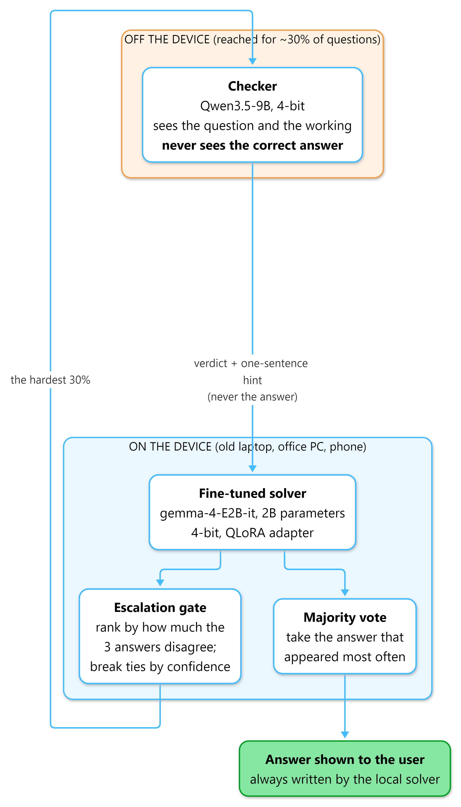
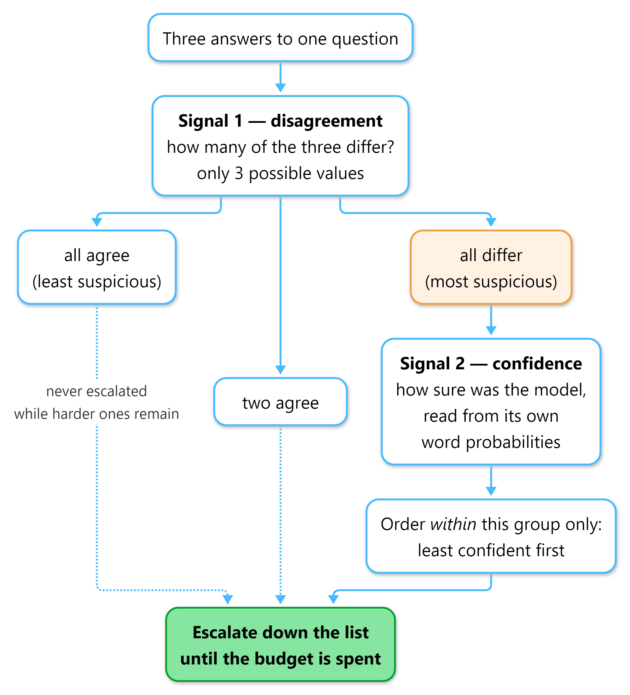
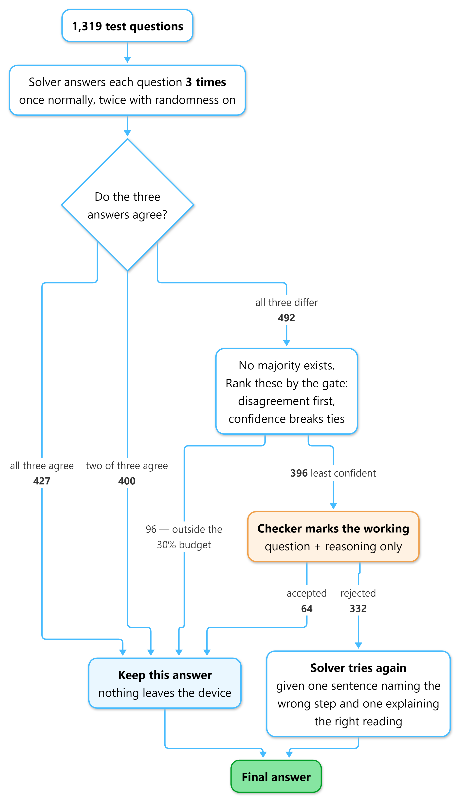
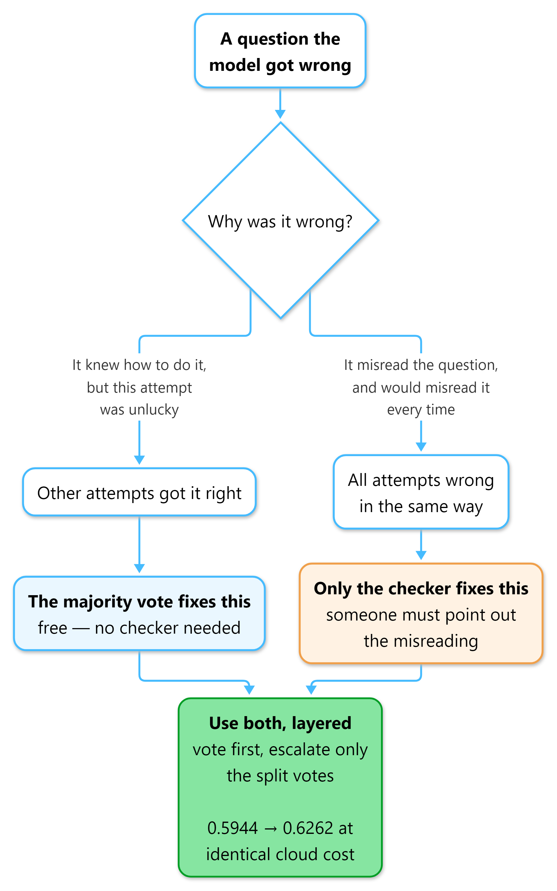
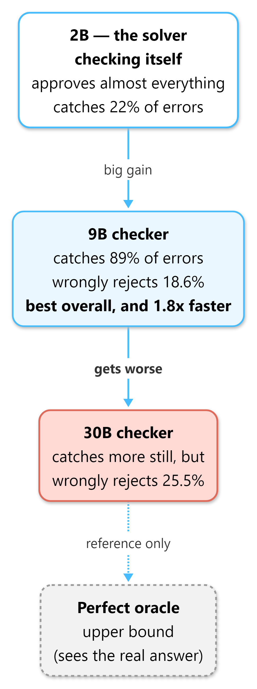
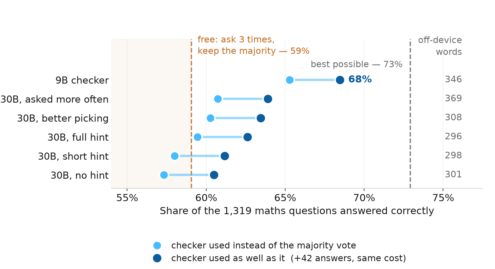

# Answer Locally, Verify Rarely: An Edge-Constrained Supervised Cascade for Small-Model Mathematical Reasoning

*Final Year Design Project*

**Authors:** [names] · **Department:** [department] · **Institution:** [institution]

---

## Abstract

Language models that are good at mathematical reasoning are large enough to require a data
centre. Running one on a phone or an ordinary laptop is not possible, and sending every
question to a cloud service costs money and moves private data off the device. We ask whether
a small model can do most of the work locally and request outside help only rarely.

We fine-tune `google/gemma-4-E2B-it` with 4-bit QLoRA on GSM8K, which raises exact-answer
accuracy from **36.32% to 55.88%** on the full 1,319-question test set while reducing tokens
read per question by a factor of eight. We then add an on-device gate that escalates about 30%
of questions to a larger verifier. The verifier marks the reasoning, never sees the reference
answer, and returns a short hint; the small model retries. The complete system reaches
**68.46%**, which is 93.9% of the 72.93% pass@3 ceiling, with 70% of questions resolved
entirely on-device.

Two results are, we believe, the paper's contribution. First, the cascade **must be stacked on
self-consistency rather than substituted for it**: run instead of free majority voting, no arm
is statistically distinguishable from it (*p* = 0.062–0.751); layered on top, every arm is, and
the gain is exactly +42 answers at identical cost. Second, **verifier capability is not
monotonic in size**: a 9B verifier outperforms a 30B one on recall, false-reject rate and
precision simultaneously, at 1.0 s against 2.1 s per judgment.

We do not claim a record. Our contribution is the trade-off curve between accuracy and how
rarely the device asks for help, together with the stacking result.

**Index Terms** — edge inference, model cascades, self-consistency, LLM verifiers, QLoRA,
quantization, mathematical reasoning, GSM8K.

---

# I. Introduction

Models that score highly on mathematical reasoning benchmarks have hundreds of billions of
parameters. They run on specialised hardware in data centres, and using one means sending the
question over a network and paying per token.

Three costs follow, and all three recur for every question asked: a monetary cost that never
amortises, the departure of potentially sensitive data from the device, and a dependency on
network availability. Running a small model locally removes all three, but small models are
substantially worse at multi-step arithmetic reasoning. This paper is about closing part of
that gap without giving up the local-first property.

Our question is deliberately narrow:

> Can a small model on the device do most of the work, and escalate to a larger model rarely
> enough that the cost and privacy properties are largely preserved?

"Rarely" carries the argument. A cascade that escalates every question is not a cascade; it is
a slow proxy for the larger model. The design is only meaningful if escalation is the
exception, and we therefore report accuracy against off-device tokens per question throughout.

## A. Contributions

1. **A supervised cascade must be stacked on self-consistency, not substituted for it.** Used
   in place of free majority voting, our cascade is not statistically distinguishable from it.
   Layered on top of it — vote first, escalate only the split votes — every configuration is,
   and the improvement is free, because the gate has already generated the samples the vote
   requires.
2. **Verifier capability is not monotonic in parameter count.** Over a four-rung ladder
   (2B self-verification, 9B, 30B-A3B, exact oracle) the 9B verifier dominates the 30B one on
   every measure taken.
3. **The most informative gate signal costs nothing when voting is already in use.** Sample
   disagreement (AUC 0.840) substantially outperforms the model's own confidence (0.715), and
   a lexicographic tie-break on confidence reaches 0.869 with no tunable weight.

## B. What we do not claim

We do not claim state-of-the-art accuracy on GSM8K. TinyGSM [20] reports 81.5% with a 1.3B
generator and a 1.3B trained verifier, and Qwen2.5-1.5B-Instruct is reported at 73.2% with no
fine-tuning and no cascade [21]. Section II-G addresses both directly. We also make no claim
about reasoning validity: our metric is the final answer only.

---

# II. Related Work

## A. Small models on mathematical reasoning

Cobbe *et al.* [1] introduced GSM8K and, with it, the ancestor of this work: training a
separate verifier to rank sampled solutions, which allowed a 6B model to outperform a 175B one.
Their verifier selects among candidates; ours returns feedback for a retry. Wei *et al.* [2]
established chain-of-thought prompting, the format of our training data. Hu *et al.* [3] and
Dettmers *et al.* [4] contributed LoRA and QLoRA respectively, which make our fine-tuning
feasible on a single consumer GPU. Li *et al.* [5] report that small models learn poorly from
the long reasoning traces produced by large models; our training data is short and
human-written, which is consistent with their recommendation.

## B. Test-time computation on a single model

Wang *et al.* [6] introduced self-consistency — sample several solutions, take the majority.
This is the most important reference for our work, because it is free, requires no second
model, and is the baseline our first design failed to beat. Aggarwal *et al.* [7] make the
sampling adaptive, stopping once agreement is reached; the instinct is the same as our gate's.
Snell *et al.* [8] show that test-time computation can outperform a model fourteen times
larger, which is the general argument our design rests on. A 2025 analysis [22] reports that
self-consistency's benefit is diminishing on newer models; we do not observe that here, where
voting yields a statistically solid +3.18 points.

## C. Cascades and routing

FrugalGPT [9] is the canonical cost-saving cascade: attempt with a cheap model, escalate when a
scorer judges the output weak, with reported cost reductions up to 98%. One structural
difference matters for cost accounting: **in FrugalGPT the expensive model answers; in ours it
only judges.** The off-device payload is therefore a short verdict rather than a full solution.

Gupta *et al.* [10] is the closest published work to our gate, deferring on token-level
uncertainty and reporting that response length is a biased signal. We measure the same effect:
length is our weakest gate at AUC 0.676. Zellinger *et al.* [11] add early abstention,
RouteLLM [12] learns a router, and Big Little Decoder [13] switches models mid-sequence. None
returns feedback for a retry.

## D. Model-based verification

Zheng *et al.* [14] established LLM-as-a-judge, reporting over 80% agreement with human
judges, and documented self-enhancement bias — models favour their own outputs. That bias
predicts our measured failure of 2B self-verification (Section V-D). Lightman *et al.* [15]
show process supervision outperforms outcome supervision; we verify whole solutions at once,
which is cheaper and weaker, and their result describes what we leave unexploited. "Not All
Votes Count!" [16] weights votes by verifier confidence, reporting up to +18% on GSM8K; this
is the nearest analogue to our stacking result, reached by a different mechanism.

## E. Negative results that motivate our design

Huang *et al.* [17] report that language models cannot reliably self-correct reasoning without
external information. Our blind-retry control replicates this on a model roughly two orders of
magnitude smaller: accuracy falls from 55.88% to 49.89%. Zhang *et al.* [18] is the closest
work to our verifier-strength question, comparing two verifier scales; we extend the comparison
to four rungs and find the relationship is not monotonic. Self-Refine [23] and Reflexion [24]
report gains from iterative self-criticism on much larger models; the tension with [17] is
unresolved in the literature, and our result falls on Huang's side.

## F. Inference on constrained hardware

Lu *et al.* [19] survey small language models, and a 2025 benchmark of over 60 edge-deployable
models [25] reports that compressed sub-7B models retain roughly 90–95% of their quality.
Bondarenko *et al.* [26] is concurrent work on efficient edge reasoning that optimises the
model itself; our approach holds the model fixed and adds a verifier, so the two are
complementary.

## G. Systems reporting higher accuracy

Two results exceed ours on GSM8K, and we address them directly.

**TinyGSM** [20] reports 81.5% using a 1.3B generator and a 1.3B trained verifier. The
protocol differs in ways that matter for a cost argument: training uses 12.3M synthetic
problems generated by GPT-3.5 (roughly 1,600× our data), solutions are executed Python rather
than natural language, the verifier is trained rather than prompted, and the headline metric is
**verify48@1** — 48 sampled generations per question, all verifier-scored. That last figure is
16× our local generation budget, on precisely the axis this paper argues about. We also note
plainly that their fine-tuning-only model reaches 68.2%, above our 55.88%, which we attribute
to the synthetic training corpus rather than to architecture.

**Qwen2.5-1.5B-Instruct** is reported at 73.2% (4-shot) in the Qwen2.5 technical report [21] —
fewer parameters than our base model, no fine-tuning, no cascade, above our complete system.

A distinction is worth making here, because "smaller model" is ambiguous. Parameter count is
not what determines whether a model runs on a device; memory is. Both systems above are
reported at 16-bit precision, whereas we deploy at 4-bit:

**TABLE I. Deployment footprint at the precision each system reports.**

| System | Parameters | Bits | Memory |
|---|---|---|---|
| TinyGSM (both models resident) | 1.3B + 1.3B | 16 | 4.84 GB |
| Qwen2.5-1.5B-Instruct | 1.54B | 16 | 2.88 GB |
| **This work, as deployed** | 5.12B stored | **4** | **2.39 GB** |

On the axis of interest, our solver is the smallest of the three despite the largest parameter
count. Two qualifications: those systems could be quantized as well — a 4-bit Qwen2.5-1.5B
would be approximately 0.72 GB — but no published score exists in that form and quantization
costs accuracy; and we assume 16-bit for their figures, as neither reports quantized results.

The fair summary is that they report higher accuracy with fewer parameters, but not with a
smaller deployment footprint. Our claims are paired comparisons on a single base model, and
the mechanism rather than the absolute score is the contribution.

---

# III. Method

**Fig. 1.** System architecture. Everything inside the device boundary runs locally. The
supervisor is contacted only for questions the gate selects, and never receives the reference
answer.

## A. Dataset

We use the official GSM8K release (`openai/gsm8k`, configuration `main`): 7,473 training and
1,319 test problems. Every reported number is measured on the complete test split.

No filtering, deduplication, or cleaning is applied; all 7,473 training problems are used, and
the calculator annotations native to the dataset (e.g. `<<48/2=24>>`) are retained. Each
example is formatted into the model's chat layout, with the reference solution terminated by
the dataset's `#### N` marker. Sequences are truncated at 1,024 tokens rather than dropped.

**Answer extraction and matching.** We extract the text following the final `####` marker,
falling back to the last numeric token when no marker is present. Before comparison, both
strings have `$` and `%` removed, trailing periods and commas stripped, the first numeric token
taken, fractions evaluated, and the result converted to an exact rational. Thus `72.0`,
`$1,200` and `1/2` match `72`, `1200` and `0.5` respectively. There is no partial credit and no
human adjudication. This logic is covered by automated tests, and the fine-tuned model produced
an extractable answer on 1,318 of 1,319 test problems.

## B. Quantization and fine-tuning

The base model is `google/gemma-4-E2B-it`, a multimodal model with 5.12B stored parameters
(4.65B in the text tower) across 35 layers, of which 20 share key/value projections with
earlier layers.

We load in 4-bit NF4 with double quantization and bfloat16 compute, then attach LoRA adapters
(rank 16, α 32, dropout 0.05) to all seven projections in each language-model layer. The
KV-sharing above means 15 layers admit seven attachment points and 20 admit five, giving 205
adapted modules rather than the expected 245, and **24,158,208 trainable parameters — 0.47% of
the model**, in a 97 MB adapter. Loss is computed on completion tokens only; prompt and padding
positions are masked.

Training runs for 3 epochs (1,404 optimizer steps) at learning rate 2e-4 with a cosine schedule
and 50 warm-up steps, batch size 1 with 16-step gradient accumulation. Training loss falls from
2.317 to 0.250 and token accuracy rises from 0.687 to 0.923. Epoch-end evaluation is disabled:
it requested an additional 4.38 GB on a 16 GB card and terminated the run at step 936, from
which we resumed at step 900. We evaluate after training by generating and grading all 1,319
test answers instead.

## C. The escalation gate

**Fig. 2.** The combined gate. Confidence reorders questions within a tied disagreement group
but can never outrank the primary signal, so no weight requires tuning.

The gate ranks questions by an on-device signal and escalates the top fraction under a fixed
budget. We evaluate four signals: response length, final-answer log-probability, disagreement
across *k* = 3 samples, and disagreement with confidence as a lexicographic tie-break.

Two properties of the disagreement gate are worth stating. First, with three samples it admits
only three values, partitioning the test set into 427 / 400 / 492 questions. The only
escalation rate the gate genuinely expresses is therefore **37.3%** (492 questions); a 30%
budget cuts inside the tied group and the implementation breaks ties by index. We report both.

Second, the tie-break is strictly subordinate. Confidence is compressed inside the smallest gap
between primary values and can never reorder them. Permitting confidence to outweigh
disagreement scored *worse* than disagreement alone. Because the combination has no weight
parameter, there is no quantity that could have been tuned on test data.

## D. The supervisor

The supervisor receives the question and the candidate solution, and returns a verdict with an
optional hint. **It never receives the reference answer**; this is enforced at the prompt
boundary and asserted by a test, and any `####` line in its reply is stripped before the
solver sees it.

Hint content is treated as a measured variable rather than a design choice, since hint length
is off-device output tokens:

- **L0** — the bare rejection (≈ 12 tokens)
- **L1** — plus a pointer naming the step that failed (≈ 30 tokens)
- **L2** — plus a correction stating the right interpretation (≈ 57 tokens)

Supervisors are served as GGUF through `llama-server` rather than through `transformers`. A 30B
mixture-of-experts model would require quantizing from ~60 GB of fp16 weights and would still
not fit; the GGUF is 17.5 GB and offloads experts to system RAM. This also makes swapping
verifiers a server restart, which is what makes the four-rung ladder affordable.

**Safety properties.** An unparseable reply is treated as an *accept*, never a reject: the
cascade must not manufacture rejections from its own defects. The corollary is that ambiguity
becomes silent approval, so empty and truncated replies are converted to errors at the provider
boundary, and the run aborts after a threshold of consecutive failures rather than approving
the remainder.

## E. Verdict caching as an experimental control

Verdicts are cached, content-addressed on `provider | model | system prompt | question |
candidate answer`. The candidate text must be in the key, since attempt 2 concerns a different
solution to the same question.

This is a validity mechanism, not an optimisation. The supervisor is not bit-reproducible —
the same prompt and model at temperature 0 produced false-reject rates of 0.500 and 0.417 in
two runs — so independently re-judging attempt 1 per arm would cause the L0/L1/L2 arms to
reject *different* sets, confounding hint content with which questions happened to be retried.
Caching makes "all arms reject the same set" structural. Measured: **396 of 396** attempt-1
verdicts replayed identically across runs made a day apart.

## F. The cascade, and stacking

**Fig. 3.** Per-question data flow across the full test set (*n* = 1,319). All counts are
measured. 923 questions (70%) are resolved entirely on-device.

The complete system proceeds as follows. The solver generates three samples. Majority voting
resolves the 827 questions where a majority exists. The gate escalates 396 of the remaining
492 under the 30% budget; the other 96 retain their first attempt. The supervisor rejects 332
of the 396; after the retry it accepts 85, and the remaining 247 receive one final unchecked
attempt.

**The stacking rule is: take the majority vote first, and use the cascade's output only where
the vote was split.** This is free. The gate has already generated the three samples the vote
requires — it needs them to measure disagreement — and the un-stacked configuration simply
discards them.

**Fig. 4.** The two repair mechanisms operate on disjoint question sets.

The gain is structural rather than incidental. Voting can only alter answers in the
two-agree/one-differs bucket, where it changes 81; the cascade operates only on the
all-differ bucket. The sets are disjoint, so the gains add without interaction — which is why
the improvement is *exactly* +42 for every arm (Section V-E).

---

# IV. Experimental Setup

All experiments run on one workstation: NVIDIA RTX 4080 SUPER (16 GB, driver 560.94), 32 GB
system RAM, Windows 11, Python 3.11.9, PyTorch 2.6.0+cu124, transformers 5.8.1, peft 0.19.1,
bitsandbytes 0.49.2, llama.cpp build b10453. **Every model, supervisor included, runs locally;
no cloud service was used for any reported number.**

Attempt 1 is greedy (temperature 0, ≤ 512 new tokens) with repetition penalty 1.15; we note
that this makes it greedy-with-penalty rather than pure argmax. Additional samples and retries
use temperature 0.7, with `top_p` and `top_k` left at library defaults. Attempt 1 is generated
once and reused across all arms; it was verified byte-identical on a 20-example resample.

The untrained baseline is evaluated 8-shot, using the first eight training problems fixed
across all test questions. This is deliberate: prompted with a bare question the base model
scores 1.5% and fails to produce an extractable answer on 566 of 1,319 problems, so a zero-shot
baseline would materially overstate the fine-tuning gain.

The supervisor prompt was calibrated on 150 **training** problems. An earlier prompt was
calibrated on test problems; on discovering this we repeated the comparison on held-out
training data, where the original prompt proved net harmful (−3.2 expected answers per 150)
against the adopted prompt (+2.6). We report the procedure rather than only the outcome.

We report 19 complete system configurations; the per-configuration catalogue, with two diagrams
and full cost accounting for each, accompanies this paper.

---

# V. Results

## A. Fine-tuning

**TABLE II. Fine-tuning, full GSM8K test set (n = 1,319).**

| Condition | Correct | Accuracy | Prompt tok. | Gen. tok. | Total tok. |
|---|---|---|---|---|---|
| Base model, 8-shot | 479 | 36.32% | 1,617.7 | 120.6 | 1,738.3 |
| **QLoRA fine-tuned, 0-shot** | **737** | **55.88%** | **87.7** | 125.9 | **213.5** |

**+19.56 points at 12.3% of the token cost.** The token reduction should be stated carefully:
the fine-tuned model is not more concise — it generates slightly more (125.9 against 120.6).
The saving is entirely on the input side, from eliminating the eight in-context exemplars.

## B. Free baselines and the ceiling

**TABLE III. Configurations requiring no second model.**

| Condition | Correct | Accuracy | Off-device cost |
|---|---|---|---|
| Fine-tuned, single sample | 737 | 55.88% | 0 |
| Blind retry, take last | 658 | **49.89%** | 0 |
| Self-consistency@3 | 779 | **59.06%** | 0 |
| pass@3 ceiling | 962 | **72.93%** | 0 |

Three observations. **Blind retry is actively harmful**, costing 6 points: on one sample it
repaired 141 of 582 wrong answers while breaking 229 of 737 correct ones. Resampling is
asymmetric and hostile, which is the principal reason verifier *precision* matters more than
recall in this design. **Self-consistency is a strong free baseline** at 59.06%. And **72.93%
is a hard ceiling**: an answer the solver never produces cannot be recovered by any verifier,
so all subsequent results should be read against the 55.88%–72.93% band.

## C. Gate quality

**TABLE IV. Gate signal quality (AUC) on the full test set.**

| Signal | AUC | Cost |
|---|---|---|
| Length | 0.676 | free |
| Confidence, final-answer logprob | 0.715 | 1 forward pass |
| Disagreement (*k* = 3 samples) | **0.840** | 2 extra generations |
| **Combined: disagreement, ties broken by confidence** | **0.869** | no extra cost |

Disagreement across samples is a substantially stronger error signal than any single-pass
confidence measure. At the operating budget of 30% (396 questions, 582 errors present):

**TABLE V. Errors caught at a 30% escalation budget.**

| Signal | Errors caught | Precision |
|---|---|---|
| Length | 249 | 62.9% |
| Confidence | 267 | 67.4% |
| Disagreement | 315 | 79.5% |
| **Combined** | **325** | **82.1%** |

The practical consequence is that the best available gate signal is already paid for whenever
self-consistency is in use.

## D. Verifier strength is a measured variable

**Fig. 5.** Supervisor capability is not monotonically beneficial.

**TABLE VI. The verifier ladder.**

| Verifier | Size | Recall | False-reject | Precision | s / judgment |
|---|---|---|---|---|---|
| Self-verification | 2B | 0.22 | 0.42 | 0.44 | 13.0 |
| **Qwen3.5-9B** | 9B | **0.888** | **0.186** | **0.791** | **1.00** |
| GLM-4.7-Flash | 30B-A3B | 0.835 | 0.255 | 0.721 | 2.07 |
| Exact oracle | — | 1.000 | 0.000 | 1.000 | — |

**Self-verification fails comprehensively.** The 2B solver judging its own work caught 22% of
errors, wrongly rejected 42% of correct answers, and produced unparseable output on 19 of 30
trials. It was also **6× slower per judgment than the 30B model** — serving stack and active
parameter count dominate total parameter count. This is the behaviour self-enhancement bias
[14] predicts.

**The 9B verifier dominates the 30B one** on recall (+31 errors caught), false-reject rate
(−51 correct answers broken) and precision, at half the latency and a third of the file size
(5.6 GB against 16.3 GB). Given the resampling asymmetry of Section V-B, the false-reject
column is the expensive one: a larger verifier more willing to find fault with correct
reasoning is not more careful, it is more costly. There appears to be a verifier scale suited
to this task, and 30B overshoots it.

*Caveat:* the 2B row is a 30-question preflight, not a full pass. Section V-G explains why we
now treat small trials as budget decisions only.

## E. The full system

**TABLE VII. Accuracy against off-device cost.**

| Configuration | Correct | Accuracy | Off-device tok./q | Calls |
|---|---|---|---|---|
| Fine-tuned solver | 737 | 55.88% | 0.0 | 0 |
| Self-consistency@3 | 779 | 59.06% | 0.0 | 0 |
| GLM cascade, un-stacked | 784 | 59.44% | 296.0 | 712 |
| GLM cascade, stacked | 826 | 62.62% | 296.0 | 712 |
| GLM @ 37.3%, stacked | 843 | 63.91% | 369.0 | 889 |
| GLM combined gate, stacked | 837 | 63.46% | 307.5 | 728 |
| Qwen cascade, un-stacked | 861 | 65.28% | 345.8 | 728 |
| **Qwen combined gate, stacked** | **903** | **68.46%** | **345.8** | **728** |
| *pass@3 ceiling* | *962* | *72.93%* | — | — |

**Fig. 6.** Accuracy against off-device tokens per question. Hollow markers denote dominated
configurations.

The best configuration reaches **68.46% — 93.9% of the pass@3 ceiling**, with **70% of
questions resolved entirely on-device** and a mean of 345.8 off-device tokens per question
across the whole test set.

**The stacking effect.** Every stacked arm gains **exactly +42 answers** over its un-stacked
counterpart at identical cost: 756→798, 765→807, 784→826, 801→843, 795→837. The invariance is
the structural property predicted in Section III-F — voting and escalation operate on disjoint
buckets — and not a tuned quantity.

**Feedback level.** Holding everything else fixed, richer hints help monotonically: L0 57.32%,
L1 58.00%, L2 59.44% un-stacked. L2 costs 5.5× L0's output tokens for +2.1 points. All three
arms rejected an identical question set, by the caching control of Section III-E.

## F. Significance

Both systems answer identical questions, so we use **exact** McNemar on the discordant pairs —
the exact binomial rather than the χ² approximation, since several discordant counts are small.

**TABLE VIII. Significance (McNemar, exact) against two controls.**

| Configuration | vs. fine-tuned (*p*) | vs. self-consistency (*p*) |
|---|---|---|
| Cascade only, GLM-30B | <0.001 | **0.247** |
| Cascade + voting, GLM-30B | <0.001 | <0.001 |
| Cascade only, Qwen-9B | <0.001 | <0.001 |
| Cascade + voting, Qwen-9B | <0.001 | <0.001 |

The second column is the one that matters, and row 1 is the result we consider most important
to report. **Against free self-consistency, no un-stacked GLM configuration is
distinguishable** — *p* = 0.062, 0.275, 0.751, 0.127 and 0.247 for the five arms. As
configured, that cascade is not justified over majority voting despite 712 supervisor calls.

Two independent remedies recover the result. Stacking moves every arm to significance
(e.g. 23 vs 70 discordant, *p* < 0.001). And changing the verifier does so even without
stacking: the un-stacked Qwen arm reaches 65.28% against 59.06%, 148 vs 66 discordant,
*p* < 0.001. **The original null was a property of the verifier, not of the design.**

The best system flips 190 answers wrong→right against 24 right→wrong — the most favourable
ratio of any configuration tested, and a direct consequence of the 9B verifier's lower
false-reject rate.

## G. Latency, and a correction to the cost argument

**TABLE IX. Measured latency (n = 40 questions).**

| Operation | Mean |
|---|---|
| Local solution generation | 15.12 s |
| Qwen3.5-9B judgment | 1.00 s |
| GLM-4.7-Flash judgment | 2.07 s |
| On-device path (composed) | 45.37 s |
| Escalated path (composed) | 59.05 s |
| **Mean across all questions** | **49.47 s** |

The composed system is 3.3× slower than a single answer. The breakdown reframes the argument:
generating three local samples accounts for **91.7%** of the time, the retry 7.7%, and
**waiting on the supervisor 0.6%**.

We state the consequence plainly. **Rare escalation is justified by data locality and monetary
cost, not by latency.** The expense is the gate's sampling, which is local. A reader should not
take "the cascade is fast" from this work. Note also that the 2B solver through `transformers`
is 15× slower per token than the 9B supervisor through `llama.cpp`, which suggests the largest
available speed improvement is a serving change rather than a modelling one.

These figures come from a desktop GPU, not the deployment target, and should be read as a
lower bound.

---

# VI. Discussion

## A. The obvious design does not work

Our first complete system escalated 30% of questions to a 30B supervisor with full hints and
reached 59.44%, against 59.06% for majority voting at zero off-device cost, *p* = 0.751. Five
answers, for 712 supervisor calls.

The error was treating voting and verification as alternatives. They repair disjoint question
sets: voting resolves the bucket where a majority exists, verification operates where no
majority exists. Because the gate already samples three times, the vote is available at no
additional cost, and discarding it is a pure loss. Stacking recovers +42 answers at identical
expenditure.

We consider this the most transferable finding in the paper, because it is the mistake a
reader implementing a cascade over a small model is most likely to repeat.

## B. Bigger verifiers are not better verifiers

The 9B model dominates the 30B on every measured axis. We attribute this to the asymmetry
established in Section V-B: because resampling breaks correct answers more often than it
repairs incorrect ones, every false rejection is a negative-expectation gamble. A larger model
more inclined to find fault in valid reasoning converts that inclination directly into lost
accuracy. Verifier selection should therefore optimise false-reject rate, not capability in
the abstract — and the 5.6 GB verifier is also the one that fits alongside the solver.

## C. The first failure was the verifier's

Section V-F's null against self-consistency did not survive the verifier change: the un-stacked
Qwen configuration beats voting at *p* < 0.001. The cascade design was sound throughout; it was
being evaluated with a verifier whose false-reject rate consumed the gain. This is a caution
about generalising from a single verifier — a negative result for a cascade may be a negative
result for one judge.

---

# VII. Limitations

1. **The pass@3 ceiling (72.93%) bounds everything.** No verifier can recover an answer the
   solver never generated.
2. **We verify final answers, not reasoning.** No claim is made that solutions are correct for
   the right reasons; the hand-labelled study that would establish this was not performed.
3. **Retries are not reproducible per question.** Aggregate accuracy is stable (0.3232 vs
   0.3308 on the shared set, *p* = 0.826) but only 32% of individual final answers were
   identical across runs. Our results are reproducible as rates, not as per-question outcomes.
4. **Effects below roughly 40 answers are undetectable** at *n* = 1,319. The combined gate's
   +11 (*p* = 0.343) lies inside that band; we report it as a cost saving (17% fewer off-device
   tokens) rather than an accuracy claim.
5. **Anchoring.** The retry prompt contains the rejected solution, risking repetition of the
   original error. We observed this qualitatively but did not quantify it.
6. **The self-verification row is 30 questions**, and Section V-G shows why that warrants
   caution.
7. **The stacking hypothesis was formed after observing test results.** It was not
   pre-registered. We disclose this rather than present it as planned.
8. **Verifiers are not bit-reproducible**, which the verdict cache controls for within our
   comparisons but which remains a property of the tooling.
9. **All latency is from a desktop GPU**, not from the constrained hardware the design targets.
10. **Our best score is slightly understated.** The 9B verifier truncated 50 of 728 replies
    (6.9%); 8 of those waved through incorrect answers, worth roughly 2 answers.
11. **One solver, one dataset.** The gate, tie-break and stacking behaviours are demonstrated
    on `gemma-4-E2B-it` on GSM8K. **This is the most substantial open question in the work.**
    The mechanism is shown to work; its generality is future work.
12. **GSM8K is a controlled probe, not a workload.** It was selected for automatic, unambiguous
    grading, not because grade-school arithmetic on-device is a pressing need.

A methodological note that cost us time and may save a reader some. A 30-question preflight put
the 9B verifier's false-reject rate at 0.417; the full pass measured 0.186, reversing the
recommendation and nearly causing us to discard our best verifier. Part of the cause was
mechanical — a 200-token reply cap truncated a model that writes longer replies. The rule we
adopted: **a preflight decides whether to spend the GPU time; it never decides what to
conclude.**

---

# VIII. Conclusion

We built and measured an edge-constrained supervised cascade for grade-school mathematical
reasoning. A 4-bit 2B solver fine-tuned with QLoRA reaches 55.88% on GSM8K; adding a
self-consistency vote, a free disagreement gate, and a 9B supervisor consulted on 30% of
questions reaches **68.46%**, or 93.9% of the pass@3 ceiling, with 70% of questions resolved
entirely on-device.

Three findings we would defend. A supervised cascade must be **stacked on** self-consistency
rather than substituted for it: substituted, ours was statistically indistinguishable from
free voting; stacked, every arm gained exactly +42 answers at identical cost. **Verifier
capability is not monotonic in size** — a 9B verifier dominated a 30B one on every measure
while running twice as fast. And **the strongest gate signal is free** when voting is already
in use, since sample disagreement (AUC 0.840) outperforms single-pass confidence (0.715), with
a lexicographic tie-break reaching 0.869 without introducing a tunable weight.

Future work, in order of expected value: serve the solver through the same optimised runtime as
the supervisor, since 91.7% of latency is local sampling and the supervisor is 15× faster per
token; test whether the gate and stacking behaviours transfer to a different solver; measure on
the constrained hardware the design targets; and hand-label a reasoning sample to close
Limitation 2.

---

# References

[1] K. Cobbe *et al.*, "Training verifiers to solve math word problems," 2021.
[2] J. Wei *et al.*, "Chain-of-thought prompting elicits reasoning in large language models," 2022.
[3] E. Hu *et al.*, "LoRA: Low-rank adaptation of large language models," 2022.
[4] T. Dettmers *et al.*, "QLoRA: Efficient finetuning of quantized LLMs," 2023.
[5] Y. Li *et al.*, "Small models struggle to learn from strong reasoners," 2025.
[6] X. Wang *et al.*, "Self-consistency improves chain of thought reasoning in language models," 2023.
[7] P. Aggarwal *et al.*, "Let's sample step by step: Adaptive-consistency," 2023.
[8] C. Snell *et al.*, "Scaling LLM test-time compute optimally," 2024.
[9] L. Chen, M. Zaharia, and J. Zou, "FrugalGPT: How to use large language models while reducing cost and improving performance," 2023.
[10] N. Gupta *et al.*, "Language model cascades: Token-level uncertainty and beyond," 2024.
[11] M. Zellinger *et al.*, "Cost-saving LLM cascades with early abstention," 2025.
[12] I. Ong *et al.*, "RouteLLM: Learning to route LLMs with preference data," 2024.
[13] S. Kim *et al.*, "Big Little Decoder: Fast inference via collaborative generation," 2023.
[14] L. Zheng *et al.*, "Judging LLM-as-a-judge with MT-Bench and Chatbot Arena," 2023.
[15] H. Lightman *et al.*, "Let's verify step by step," 2023.
[16] "Not all votes count! Programs as verifiers improve self-consistency of language models for math reasoning," 2024.
[17] J. Huang *et al.*, "Large language models cannot self-correct reasoning yet," 2024.
[18] Z. Zhang *et al.*, "Small language models need strong verifiers to self-correct reasoning," 2024.
[19] Z. Lu *et al.*, "Small language models: Survey, measurements, and insights," 2024.
[20] B. Liu *et al.*, "TinyGSM: Achieving >80% on GSM8K with small language models," 2023.
[21] Qwen Team, "Qwen2.5 technical report," 2024.
[22] "Self-consistency is losing its edge," 2025.
[23] A. Madaan *et al.*, "Self-Refine: Iterative refinement with self-feedback," 2023.
[24] N. Shinn *et al.*, "Reflexion: Language agents with verbal reinforcement learning," 2023.
[25] "Demystifying small language models for edge deployment," ACL 2025.
[26] A. Bondarenko *et al.*, "Efficient reasoning on the edge," 2026.

*Full BibTeX entries with arXiv identifiers are in `docs/references.bib`.*
