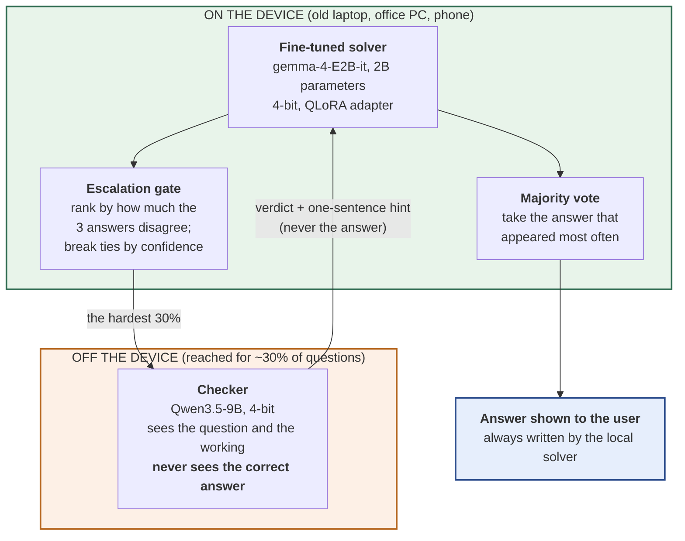
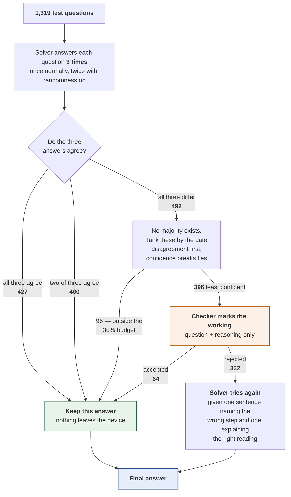
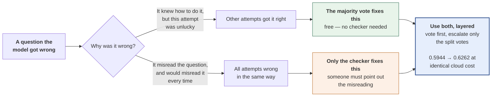
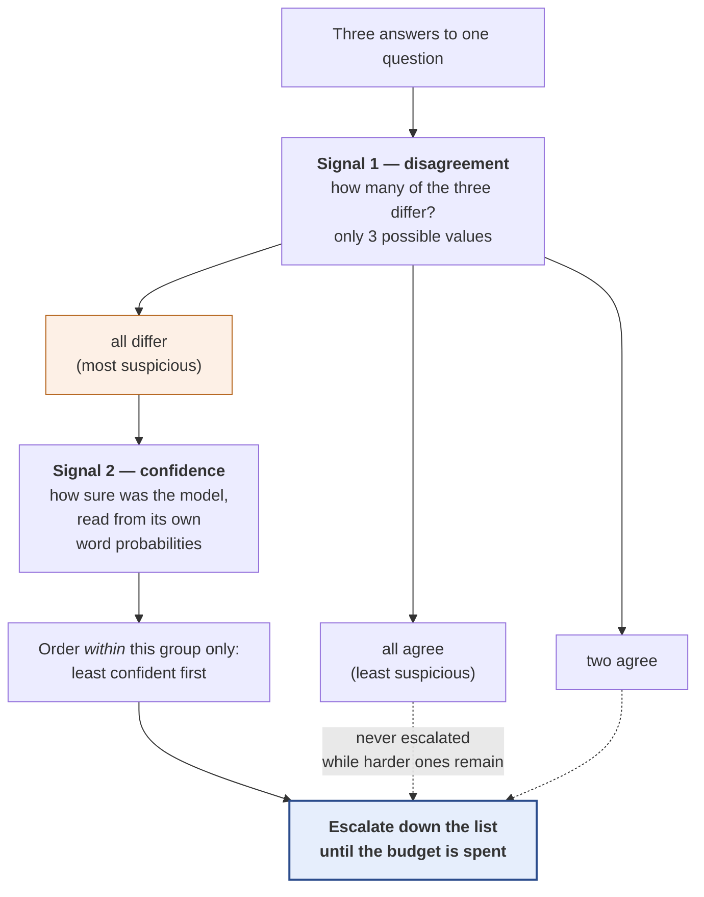
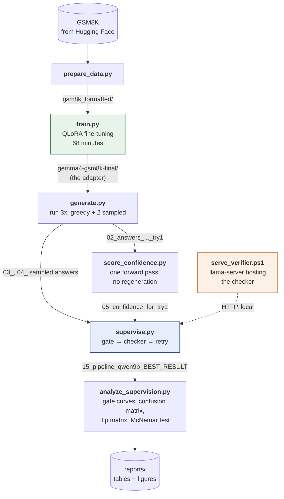
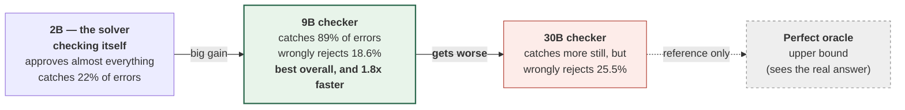

# Diagrams for the paper — technical wording

> **Two versions of every diagram exist. This is the technical one.**
>
> | Version | File | Pictures | Use it for |
> |---|---|---|---|
> | **Plain language** | [`docs/DIAGRAMS.md`](../DIAGRAMS.md) | `reports/figures/` | Teammates who are not engineers; explaining the system to anyone; a defence audience that includes non-specialists |
> | **Technical** (this file) | `docs/diagrams-technical/DIAGRAMS_TECHNICAL.md` | `reports/figures/technical/` | The submitted paper, if your supervisor prefers standard terminology in figures |
>
> They show the **same system with the same measured numbers** — only the wording
> differs. The file names match across both folders, so you can swap one set for the
> other without touching your document's figure references.
>
> **If you change a number, change it in both files.** That is the one risk of
> keeping two versions, and nothing checks it for you.

**Who this is for:** whoever is assembling the report. Each diagram below has a
caption you can paste, a note on which section it belongs in, and the source that
draws it.

**How to use these.** Every diagram is written in Mermaid, a plain-text way of
describing a picture. GitHub draws them automatically, so scrolling this page in the
browser shows the finished images. Ready-to-insert files are in
`reports/figures/technical/` as both `.svg` (sharp at any size — use this in Word or
LaTeX if you can) and `.png` (works everywhere).

**To change one:** edit the text in the code block, then run
`.\scripts\render_diagrams.ps1` to redraw the image files. You do not need design
software, and you should not redraw these by hand in Canva or PowerPoint — the text is
the master copy, and a hand-drawn duplicate will drift out of date the moment a number
changes.

**Every number in these diagrams comes from the measured runs.** If a number changes
in `THESIS_DOSSIER.md`, change it here too, in the same commit.

---

## Figure 1 — System architecture
<!-- figure: fig1_system_architecture -->

**Goes in:** Method, as the first figure. **Caption you can paste:**

> Figure 1: System architecture. The fine-tuned 2B solver, the majority vote and the
> escalation gate all run on the local device. The checker is reached only for
> questions the gate selects, and never receives the correct answer.



**The point of this figure:** everything expensive is inside the green box. The orange
box is the only thing that leaves the device, and it is a *checker*, not an answerer —
the small model writes every answer that ships.

---

## Figure 2 — Per-question data flow
<!-- figure: fig2_per_question_data_flow -->

**Goes in:** Method, immediately after Figure 1. This is the most important diagram in
the paper. **Caption you can paste:**

> Figure 2: Per-question data flow across the full GSM8K test set (n = 1,319). Counts
> are measured, not illustrative. 923 questions (70%) are resolved entirely on the
> device; 396 (30%) are escalated to the checker, of which 332 are rejected and
> retried with a hint.



**Two things to say about this figure in the text:**

1. **923 of 1,319 questions never leave the device** — 827 because a majority existed,
   plus 96 that had no majority but fell outside the escalation budget.
2. **The three answers were needed for the gate anyway.** The majority vote is
   therefore free: it reuses work already done. This is the reason the stacked design
   costs nothing extra (Figure 3).

---

## Figure 3 — Why stacking works
<!-- figure: fig3_why_stacking_works -->

**Goes in:** Discussion, as the figure for the headline finding. **Caption:**

> Figure 3: The two mechanisms repair different questions. Majority voting corrects
> unlucky sampling; the checker corrects consistent misreadings. Because the sets
> barely overlap, using the checker *instead of* the vote discards free accuracy —
> which is why every un-stacked arm failed to beat self-consistency.



**Say in the text:** run *instead of* the vote, no arm was statistically
distinguishable from free self-consistency (p = 0.062 / 0.275 / 0.751). Layered *on
top* of it, every arm was.

---

## Figure 4 — The escalation gate
<!-- figure: fig4_the_escalation_gate -->

**Goes in:** Method, where the gate is described. **Caption:**

> Figure 4: The combined gate. Questions are ordered by how much the three samples
> disagree; ties within a disagreement level are broken by the model's own confidence.
> Confidence can reorder questions inside a tied group but can never outrank
> disagreement, so there is no weight to tune.



**Why this design:** a 3-sample disagreement signal has only three possible values, so
on its own it cannot choose *which* of the 492 tied questions to send. Confidence
breaks those ties. Letting confidence outweigh disagreement scored *worse* than
disagreement alone, so it is deliberately confined to tie-breaking.

Measured effect: gate quality (AUC) **0.840 → 0.869**, and 105 → 125 errors caught at a
10% escalation budget. It costs nothing — both signals were already being computed.

---

## Figure 5 — Experiment pipeline
<!-- figure: fig5_experiment_pipeline -->

**Goes in:** an appendix, or the reproducibility paragraph. **Caption:**

> Figure 5: Experimental pipeline. Each box is a script in the repository; each arrow
> names the file it writes. Attempt 1 is generated once and reused by every cascade
> arm, so all arms start from byte-identical answers and comparisons are exactly
> paired.



---

## Figure 6 — Checker strength ladder
<!-- figure: fig6_checker_strength_ladder -->

**Goes in:** Results, with RQ5. **Caption:**

> Figure 6: Checker strength is a measured variable. Moving from the 2B self-check to
> a 9B checker buys a large gain in errors caught; moving from 9B to 30B makes false
> rejections worse. Bigger is not uniformly better.



**The sentence this figure exists to support:** *there is a checker size that fits the
task, and 30B overshoots it.* A model that rejects too readily destroys correct answers
faster than it repairs wrong ones.

---

## What should NOT be a diagram

Results that are *numbers* belong in tables or charts, not boxes and arrows:

- **Accuracy against cloud cost** — already drawn: `reports/figures/pareto.png`. Use it
  as the headline results figure.
- **The flip matrix** (answers turned right vs turned wrong) — a 2x2 table reads better
  than any diagram.
- **The results ledger** — a table. Do not try to draw it.

---

## Redrawing the images

`.\scripts\render_diagrams.ps1` redraws **both** versions — the plain-language set into
`reports/figures/`, and this technical set into `reports/figures/technical/`. The file
names are identical in both folders:

| File | Figure |
|---|---|
| `fig1_system_architecture` | System architecture |
| `fig2_per_question_data_flow` | The journey of one question |
| `fig3_why_stacking_works` | The headline finding |
| `fig4_the_escalation_gate` | How questions are chosen for the checker |
| `fig5_experiment_pipeline` | Which script wrote which file |
| `fig6_checker_strength_ladder` | RQ5 |

To redraw only this set:

```powershell
.\scripts\render_diagrams.ps1 -Technical
```
