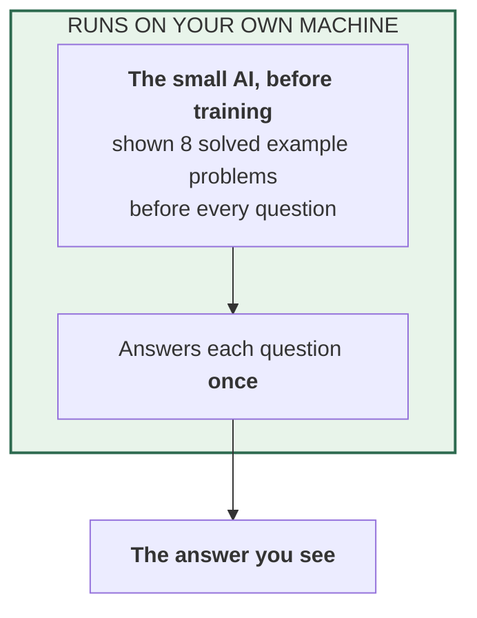
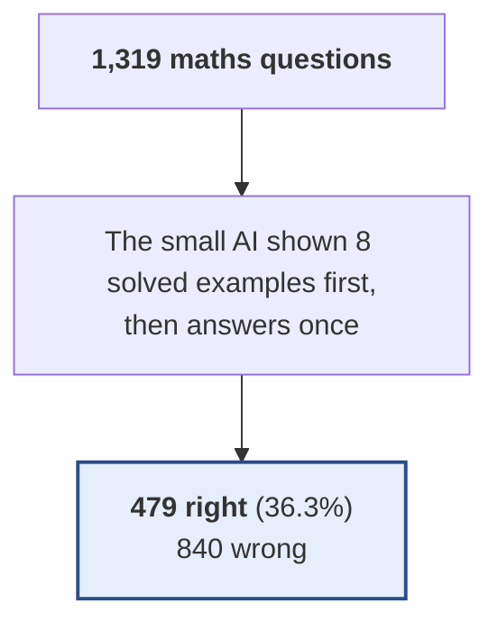

# 01 — The small AI before we trained it

**In standard terms:** Untrained gemma-4-E2B-it, 8-shot chain-of-thought prompt

The model exactly as Google released it, answering each question once. Because an untrained model does not know the answer format, it is shown 8 solved example problems before every question. This is the starting point everything else is compared against.

## What it is made of

## What happens to the questions

## Results

| | |
|---|---|
| Right answers | **479 of 1,319 — 36.32%** |
| Compared with the trained AI answering once | -19.56 percentage points |
| Answers turned from wrong to right | 138 |
| Answers turned from right to wrong | 396 |
| AI attempts per question | 1.00 |
| Words the small AI writes per question (tokens) | 120.6 |
| Words the small AI reads per question (tokens) | 1617.7 |
| Questions sent to the marker | 0 (0.0%) |
| Times the marker was asked | 0 |
| Tokens exchanged with the marker per question | 0.0  (in 0.0 / out 0.0) |
| Marker replies that could not be read (counted as 'right') | 0 |
| Small AI writing speed (measured) | 8.8 tokens/second |
| Marker time per check (measured) | — |
| **Time per question (estimated)** | 13.7 s |
| **Time for all 1,319 questions (estimated)** | 5 h 00 min |

> **The time estimate does not hold for this system.** The writing speed was measured with the training add-on loaded, and this untrained model runs without it. The experiment log shows the real run was much faster — see *How accurate are the time estimates?* in [`../README.md`](../README.md).

**Where these numbers come from:** `outputs/predictions/01_answers_untrained_baseline.jsonl`. Every count, including the ones inside the
diagrams, is computed from that file by `scripts/build_experiment_catalogue.py`.
Time is estimated from measured speeds, because the runs did not record their own
duration — see the main table in [`../README.md`](../README.md).

Diagram source (edit the generator, not this)

