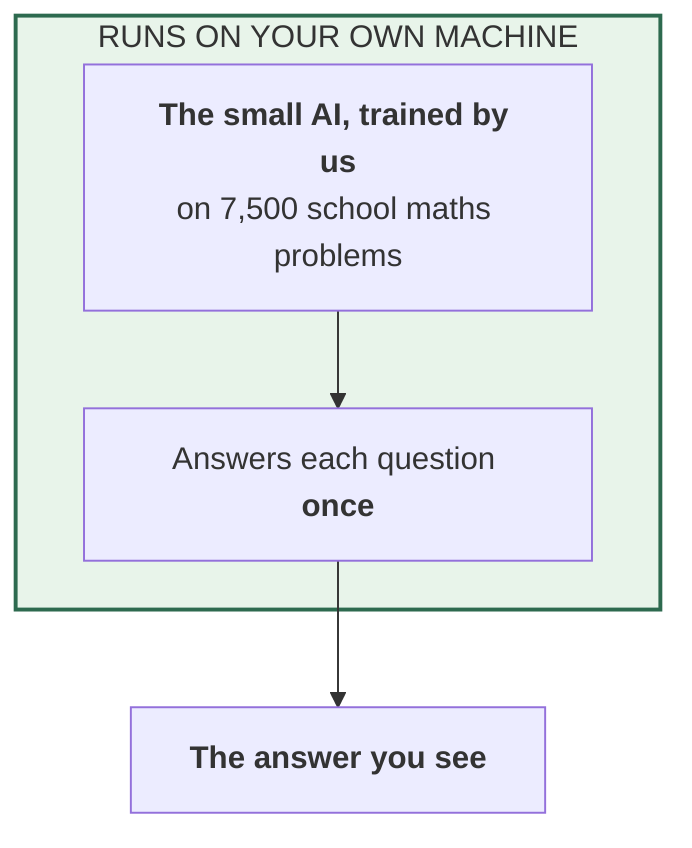
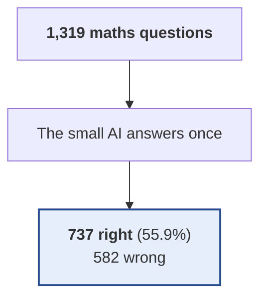

# 02 — The small AI after training, answering once

**In standard terms:** QLoRA fine-tuned gemma-4-E2B-it, zero-shot greedy decoding

The same small AI after we trained it on 7,500 school maths problems. It answers each question once, with no help and no second attempt.

## What it is made of

## What happens to the questions

## Results

| | |
|---|---|
| Right answers | **737 of 1,319 — 55.88%** |
| Compared with the trained AI answering once | +0.00 percentage points |
| Answers turned from wrong to right | 0 |
| Answers turned from right to wrong | 0 |
| AI attempts per question | 1.00 |
| Words the small AI writes per question (tokens) | 125.9 |
| Words the small AI reads per question (tokens) | 87.7 |
| Questions sent to the marker | 0 (0.0%) |
| Times the marker was asked | 0 |
| Tokens exchanged with the marker per question | 0.0  (in 0.0 / out 0.0) |
| Marker replies that could not be read (counted as 'right') | 0 |
| Small AI writing speed (measured) | 8.8 tokens/second |
| Marker time per check (measured) | — |
| **Time per question (estimated)** | 14.3 s |
| **Time for all 1,319 questions (estimated)** | 5 h 14 min |

**Where these numbers come from:** `outputs/predictions/02_answers_finetuned_try1_main.jsonl`. Every count, including the ones inside the
diagrams, is computed from that file by `scripts/build_experiment_catalogue.py`.
Time is estimated from measured speeds, because the runs did not record their own
duration — see the main table in [`../README.md`](../README.md).

Diagram source (edit the generator, not this)

