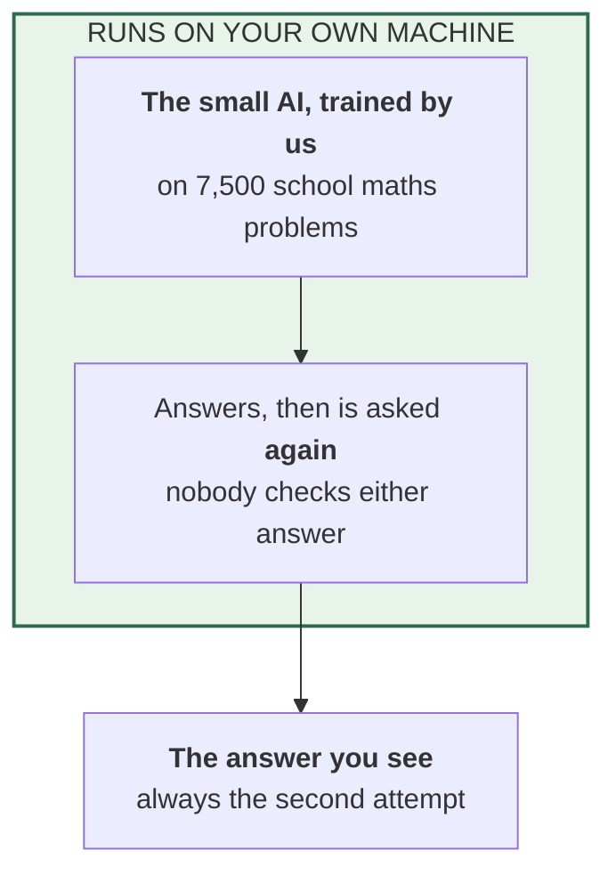
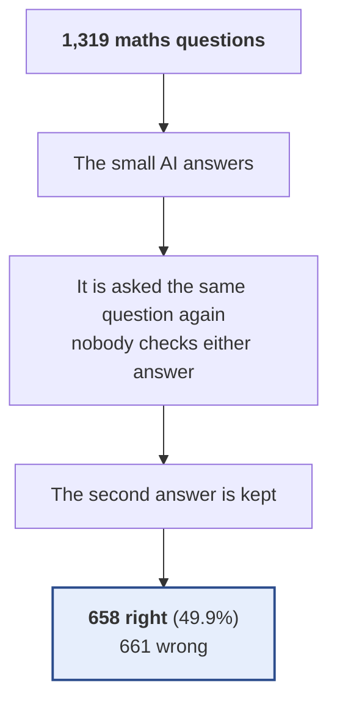

# 03 — Trained AI, asked again, keeping the second answer

**In standard terms:** Fine-tuned model, resample and take the last sample (no verifier)

The trained AI answers, then is simply asked again, and the second answer is kept. Nobody checks either answer. This is the control that shows whether a retry helps on its own, without any marker.

## What it is made of

## What happens to the questions

## Results

| | |
|---|---|
| Right answers | **658 of 1,319 — 49.89%** |
| Compared with the trained AI answering once | -5.99 percentage points |
| Answers turned from wrong to right | 138 |
| Answers turned from right to wrong | 217 |
| AI attempts per question | 2.00 |
| Words the small AI writes per question (tokens) | 258.4 |
| Words the small AI reads per question (tokens) | 175.3 |
| Questions sent to the marker | 0 (0.0%) |
| Times the marker was asked | 0 |
| Tokens exchanged with the marker per question | 0.0  (in 0.0 / out 0.0) |
| Marker replies that could not be read (counted as 'right') | 0 |
| Small AI writing speed (measured) | 8.8 tokens/second |
| Marker time per check (measured) | — |
| **Time per question (estimated)** | 29.3 s |
| **Time for all 1,319 questions (estimated)** | 10 h 44 min |

**Where these numbers come from:** computed from `outputs/predictions/02_`, `03_` and `04_`. Every count, including the ones inside the
diagrams, is computed from that file by `scripts/build_experiment_catalogue.py`.
Time is estimated from measured speeds, because the runs did not record their own
duration — see the main table in [`../README.md`](../README.md).

Diagram source (edit the generator, not this)

