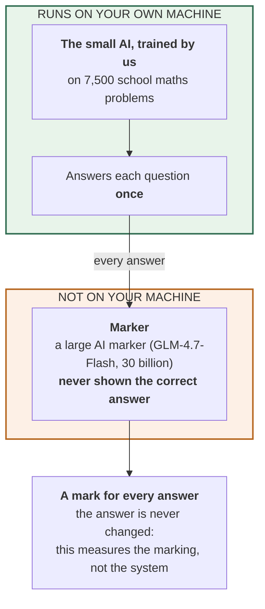
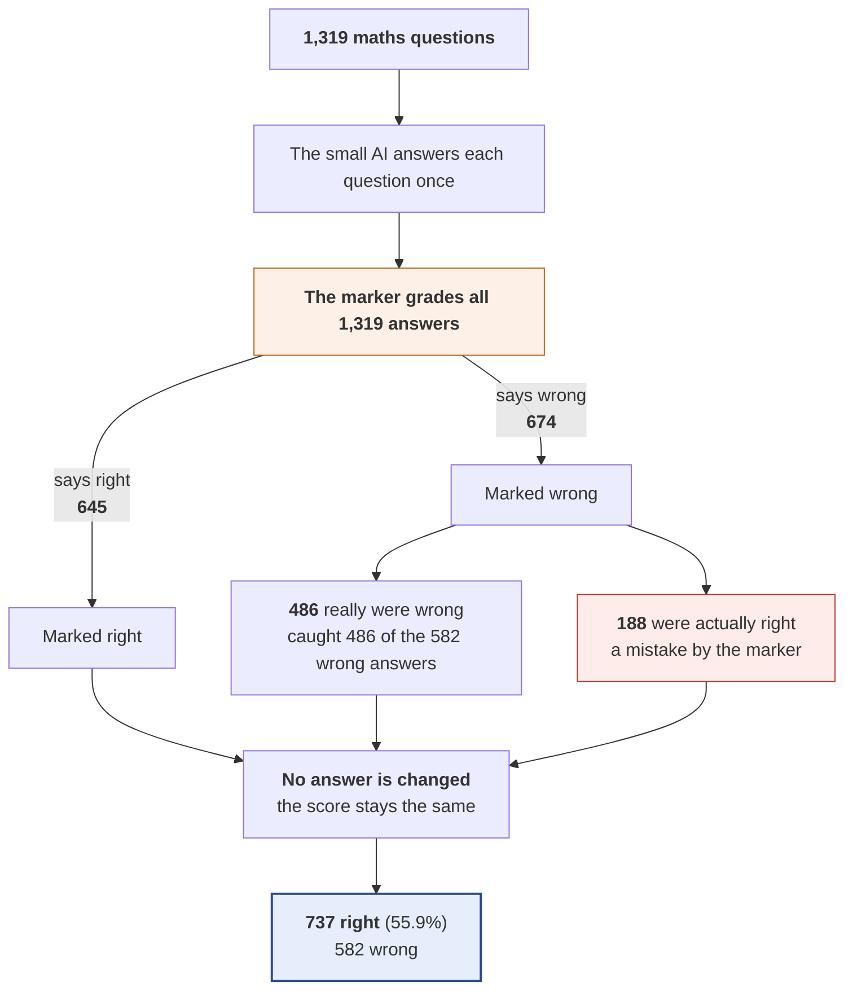

# 05 — A large AI marks every answer (measuring the marker)

**In standard terms:** Verdict-only pass: GLM-4.7-Flash judges every attempt-1 answer, no retry

The large AI marker grades all 1,319 answers, but the small AI is never asked to try again, so no answer changes. This experiment does not produce a better score; it measures how good the marker is at spotting wrong answers.

> **Note:** The result file's name says 'pipeline ... every question', but every row has exactly one attempt: it is a marking-only run, not a full system.

## What it is made of

## What happens to the questions

## Results

| | |
|---|---|
| Right answers | **737 of 1,319 — 55.88%** |
| Compared with the trained AI answering once | +0.00 percentage points |
| Answers turned from wrong to right | 0 |
| Answers turned from right to wrong | 0 |
| AI attempts per question | 1.00 |
| Words the small AI writes per question (tokens) | 125.9 |
| Words the small AI reads per question (tokens) | 87.7 |
| Questions sent to the marker | 1,319 (100.0%) |
| Times the marker was asked | 1,319 |
| Tokens exchanged with the marker per question | 499.1  (in 456.0 / out 43.1) |
| Marker replies that could not be read (counted as 'right') | 0 |
| Small AI writing speed (measured) | 8.8 tokens/second |
| Marker time per check (measured) | 2.07 s |
| **Time per question (estimated)** | 16.3 s |
| **Time for all 1,319 questions (estimated)** | 5 h 59 min |

## How good is this marker?

| | |
|---|---|
| Wrong answers it caught | **83.5%** |
| Right answers it wrongly failed | **25.5%** |
| When it said 'wrong', how often it was correct | 72.1% |

**Where these numbers come from:** `outputs/predictions/16_pipeline_glm30b_no_gate_every_question.jsonl`. Every count, including the ones inside the
diagrams, is computed from that file by `scripts/build_experiment_catalogue.py`.
Time is estimated from measured speeds, because the runs did not record their own
duration — see the main table in [`../README.md`](../README.md).

Diagram source (edit the generator, not this)

