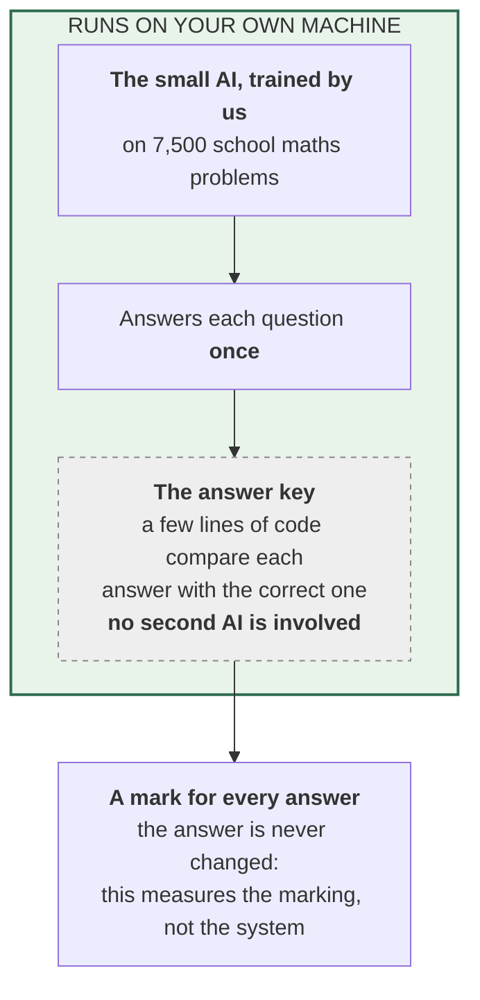
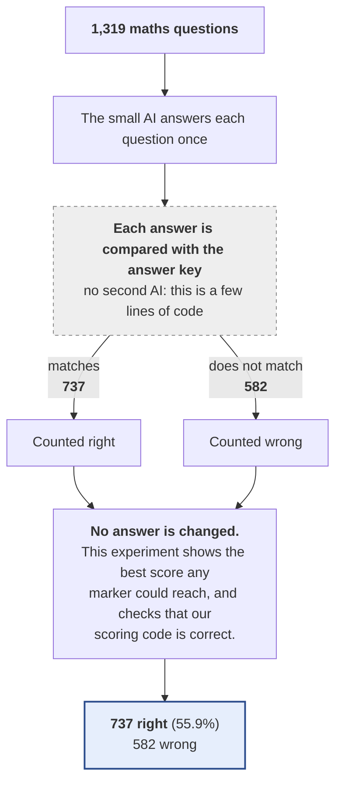

# 07 — The answer key used as the marker (the upper limit)

**In standard terms:** Verdict-only pass with the exact-match oracle; no second model is loaded

**Only one model runs in this experiment: the small AI.** There is no second model. The 'marker' is a few lines of code that compare each answer with the answer key, which is why it is never wrong. Nothing leaves the machine and no tokens are exchanged. It is here for two reasons: it shows the best score any marker could possibly reach, so the real markers in experiments 05 and 06 have something to be measured against, and it confirms our scoring code is correct — an answer key that scored anything but 100% would mean a bug.

## What it is made of

## What happens to the questions

## Results

| | |
|---|---|
| Right answers | **737 of 1,319 — 55.88%** |
| Compared with the trained AI answering once | +0.00 percentage points |
| Answers turned from wrong to right | 0 |
| Answers turned from right to wrong | 0 |
| AI attempts per question | 1.00 |
| Words the small AI writes per question (tokens) | 125.9 |
| Words the small AI reads per question (tokens) | 87.7 |
| Questions sent to the marker | 1,319 (100.0%) |
| Times the marker was asked | 1,319 |
| Tokens exchanged with the marker per question | 0.0  (in 0.0 / out 0.0) |
| Marker replies that could not be read (counted as 'right') | 0 |
| Small AI writing speed (measured) | 8.8 tokens/second |
| Marker time per check (measured) | instant (answer key) |
| **Time per question (estimated)** | 14.3 s |
| **Time for all 1,319 questions (estimated)** | 5 h 14 min |

## How good is this marker?

| | |
|---|---|
| Wrong answers it caught | **100.0%** |
| Right answers it wrongly failed | **0.0%** |
| When it said 'wrong', how often it was correct | 100.0% |

**Where these numbers come from:** `outputs/predictions/09_checker_perfect_oracle_marks_all.jsonl`. Every count, including the ones inside the
diagrams, is computed from that file by `scripts/build_experiment_catalogue.py`.
Time is estimated from measured speeds, because the runs did not record their own
duration — see the main table in [`../README.md`](../README.md).

Diagram source (edit the generator, not this)

