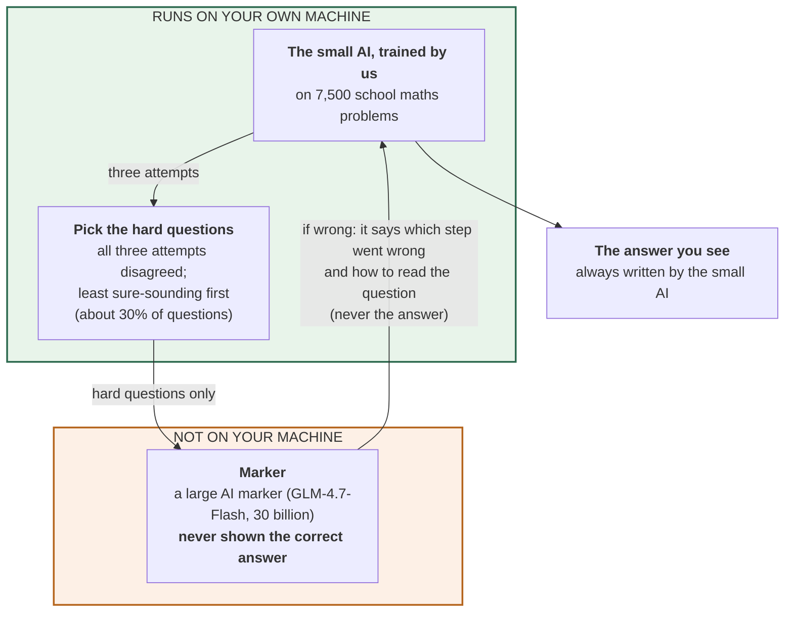
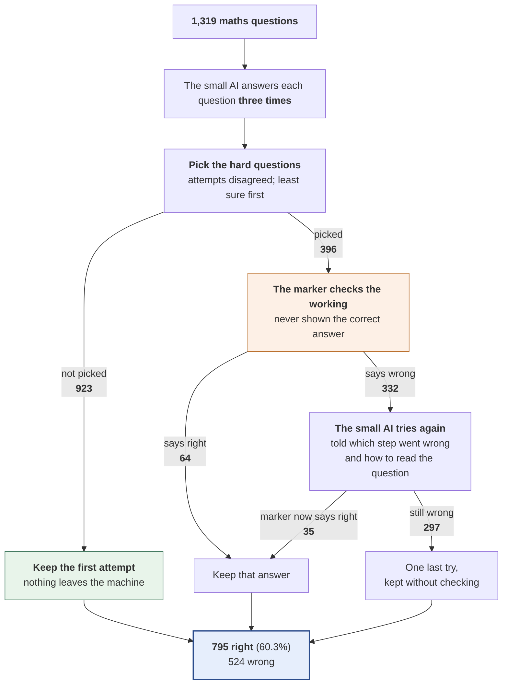

# 12 — Trained AI + smart selection of hard questions (30%) + large AI marker, full hint

**In standard terms:** combined gate (disagreement, confidence tie-break) at 30% escalation; GLM-4.7-Flash verifier; L2 feedback

The trained AI answers every question three times. On questions that are not sent for help, its first answer is kept. About 30% of questions are sent to large AI marker — the ones where all three attempts disagreed, taking first the ones the AI sounded least sure about. If the marker says the working is wrong, it replies with yes or no, which step went wrong, and how the question should be read, and the small AI tries again. The marker is never shown the correct answer.

## What it is made of

## What happens to the questions

## Results

| | |
|---|---|
| Right answers | **795 of 1,319 — 60.27%** |
| Compared with the trained AI answering once | +4.40 percentage points |
| Answers turned from wrong to right | 80 |
| Answers turned from right to wrong | 22 |
| AI attempts per question | 3.48 |
| Words the small AI writes per question (tokens) | 472.7 |
| Words the small AI reads per question (tokens) | 426.2 |
| Questions sent to the marker | 396 (30.0%) |
| Times the marker was asked | 728 |
| Tokens exchanged with the marker per question | 307.5  (in 274.7 / out 32.8) |
| Marker replies that could not be read (counted as 'right') | 0 |
| Small AI writing speed (measured) | 8.8 tokens/second |
| Marker time per check (measured) | 2.07 s |
| **Time per question (estimated)** | 54.7 s |
| **Time for all 1,319 questions (estimated)** | 20 h 03 min |

> The smart selection also reads the first answer once more to measure how sure the AI sounded. That extra read was not timed and is not in the estimate.

**Where these numbers come from:** `outputs/predictions/14_pipeline_glm30b_hint_full_smart_gate.jsonl`. Every count, including the ones inside the
diagrams, is computed from that file by `scripts/build_experiment_catalogue.py`.
Time is estimated from measured speeds, because the runs did not record their own
duration — see the main table in [`../README.md`](../README.md).

Diagram source (edit the generator, not this)

